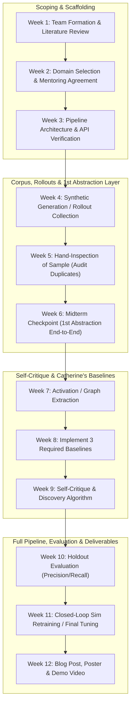

# Future Plans & 12-Week Semester Roadmap

> **Academic Context**: UC Berkeley CDSS 170 (Data Discovery Project) — Fall 2026  
> **Industry Partner**: 99P Labs / Honda Research Institute, US  
> **Industry Mentor**: Ryan Lingo  
> **Team**: Jerry Yan (Zihao Yan), Chris, Catherine Wang, Hiram Lannes, Jason  

---

## 1. 12-Week Course Execution Roadmap

The roadmap is structured into four 3-week phases, strictly aligned with Ryan Lingo's deliverables and CDSS 170 milestone reviews:

---

## 2. Phase-by-Phase Milestone Breakdown

### Phase 1: Problem Scoping & Infrastructure Setup (Weeks 1–3)
- **Week 1 (Orientation & Literature Review)**:
  - Form team communication channels; review project description from Ryan Lingo.
  - Deep-dive into literature ([`references.bib`](../references.bib) and [`LITERATURE_REVIEW.md`](LITERATURE_REVIEW.md)).
  - Examine Mobileye's Meteor/Genario architecture and recent VLA probing literature (SAFE, ProbeAct).
- **Week 2 (Mentoring Agreement & Domain Decision)**:
  - Complete and submit the CDSS 170 Mentoring Agreement with Ryan Lingo.
  - Finalize the domain decision: either commit to **Policy Failure Axis Discovery in Robotics/Driving (Track B / ActAxis)** or select one of the high-structure text domains (**Perception Sensor Reliability Grid** or **Wildfire Micro-Climate Gap**).
- **Week 3 (Environment & Compute Configuration)**:
  - Verify UC Berkeley CDSS Nautilus NRP LLM API keys (`https://ellm.nrp-nautilus.io/v1`).
  - Set up Python environment (`PyTorch`, `transformers`, `sae_lens`, `scikit-learn`, `CARLA` / `MetaDrive`).
  - Establish Git repo protocols in `Imhaohao/99p`.

### Phase 2: Corpus Construction, Planted Gaps & 1st Abstraction Layer (Weeks 4–6)
*Target Deliverable: Midterm Checkpoint (Week 6)*
- **Week 4 (Data Generation & Planted Blindspots)**:
  - Construct the core dataset (target size: 200–300 synthetic documents or 500 simulated policy rollout episodes).
  - Formulate and record the exact rules governing inclusion and generation prompts.
  - Deliberately withhold $K=5$ known scenario combinations or cross-domain mechanisms to serve as the ground-truth answer key $\mathcal{G}^*$.
- **Week 5 (Hand Inspection & Quality Auditing)**:
  - Rigorously inspect a random sample of $\ge 50$ items by hand.
  - Identify and eliminate duplicates, trivial linguistic patterns, or trivial pixel-level artifacts.
- **Week 6 (Midterm Checkpoint — First Abstraction Layer Running End-to-End)**:
  - Implement and run the first abstraction layer (e.g., intermediate layer activation extraction + initial HDBSCAN clustering, or claim extraction + concept grouping).
  - Present the preliminary pipeline and hand-inspected data audit to Ryan Lingo.

### Phase 3: Epistemic Self-Critique & Catherine's Baselines (Weeks 7–9)
- **Week 7 (Failure Axis / Open-Question Discovery Algorithm)**:
  - Implement Sparse Autoencoder (SAE) dictionary learning on hidden activations (for Track B) or claim-tension graph traversal (for Track A).
  - Implement LLM auto-captioning to translate mathematical clusters into human-interpretable descriptions.
- **Week 8 (Mandatory Baseline Implementation)**:
  Implement the three comparative baselines required by Catherine Wang:
  1. *Baseline 1 (Random Selection)*: Uniformly sampling clusters or questions.
  2. *Baseline 2 (Predefined Human Taxonomy)*: Manual metadata categorization (e.g., Weather $\times$ Lighting $\times$ Road).
  3. *Baseline 3 (Behavioral / Output-Only Clustering)*: Clustering output action errors, trajectory loss, or collision telemetry without looking at internal model representations.
- **Week 9 (Epistemic Self-Critique & Ranking Protocol)**:
  - Implement the self-critique module that estimates model uncertainty or evidence thinness.
  - Rank candidate failure axes / open questions by estimated priority and severity.

### Phase 4: Final Evaluation, Closed-Loop Retraining & Deliverables (Weeks 10–12)
*Target Deliverable: Final Showcase, Technical Blog, Poster, Video*
- **Week 10 (Holdout Evaluation against $\mathcal{G}^*$)**:
  - Run full discovery pipeline on unlabelled holdout data.
  - Calculate formal Precision and Recall metrics against the planted ground truth $\mathcal{G}^*$:
    $$\text{Precision} = \frac{|\mathcal{A}_{\text{discovered}} \cap \mathcal{G}^*|}{|\mathcal{A}_{\text{discovered}}|}, \quad \text{Recall} = \frac{|\mathcal{A}_{\text{discovered}} \cap \mathcal{G}^*|}{|\mathcal{G}^*|}$$
  - Demonstrate statistically significant outperformance over Baselines 1, 2, and 3.
- **Week 11 (Closing the Loop in Simulation)**:
  - Invert discovered failure axes into parametric simulation scenarios in CARLA/MetaDrive.
  - Fine-tune policy (LoRA) on generated scenario variations; verify failure remediation on the target axis without catastrophic forgetting.
- **Week 12 (Dissemination & Final Deliverables)**:
  - **Technical Blog Post**: Comprehensive article detailing problem formulation, architectural design, results, and critical post-mortem on *"what worked and what broke."*
  - **Research Poster**: Professional academic poster formatted for the UC Berkeley CDSS Showcase.
  - **Demo Video**: High-production 3-minute video demonstrating end-to-end rollout, activation clustering, axis discovery, and closed-loop retraining.

---

## 3. Resource Allocation & Compute Strategy

| Resource | Provider | Primary Use Case | Configuration / Access |
| :--- | :--- | :--- | :--- |
| **NRP Nautilus LLM API** | UC Berkeley CDSS | Synthetic text generation, claim extraction, LLM captioning | Endpoint: `https://ellm.nrp-nautilus.io/v1` (Llama-3-70B / Mistral) |
| **GPU Compute Nodes** | UC Berkeley / Campus HPC | OpenVLA rollout execution, SAE training, HDBSCAN clustering | 1–2 NVIDIA RTX A6000 / A100 GPUs |
| **Simulators** | Local / Server | Closed-loop policy rollouts, scenario synthesis | CARLA 0.9.15, MetaDrive, HighwayEnv |
| **Code & Model Weights** | GitHub / Hugging Face | Repo hosting, model checkpoints | `Imhaohao/99p`, Hugging Face `openvla/openvla-7b` |

---

## 4. Risk Analysis & Mitigation Strategies

| Risk / Failure Mode | Likelihood | Impact | Concrete Mitigation Strategy |
| :--- | :--- | :--- | :--- |
| **SAE Feature Death** | Moderate | High | Use TopK activation functions or Ghost Gradients during SAE training; monitor active feature counts continuously. |
| **Trivial Visual Separation** | High | High | Planted gaps must not differ trivially in pixel statistics (e.g., do not just hold out "night rain"). Use paired counterfactual scenarios where visuals match but kinematic timing or occlusions differ. |
| **LLM Output Hallucination** | Moderate | Moderate | Enforce Pydantic / JSON schema structured outputs on all LLM API calls; require explicit verbatim source quotations for claim extraction. |
| **Simulator Compute Bottleneck** | Moderate | Moderate | Prototype first on lightweight kinematic environments (`HighwayEnv` / `MetaDrive`) before scaling to full CARLA photorealistic rollouts. |
| **API Rate Limits** | Low | Moderate | Implement client-side caching (SQLite / diskcache) and exponential backoff retry wrappers for all Nautilus API requests. |
