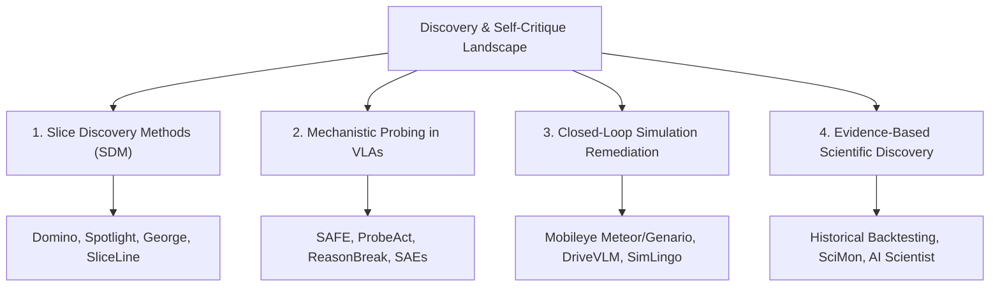

# Literature Review & Research Gap Analysis

> **Scope**: Critical state-of-the-art analysis spanning Unsupervised Slice Discovery, VLA Probing & Failure Prediction, Generative Simulation Remediation, and Automated Open-Question Discovery.  
> **Repository Grounding**: All citations correspond to entries in [references.bib](../references.bib).

---

## 1. Introduction & Taxonomy of the Field

Developing intelligent systems capable of self-critique, failure diagnosis, and gap discovery requires intersecting four distinct research frontiers:

---

## 2. Pillar 1: Unsupervised Slice Discovery Methods (SDM)

Slice Discovery Methods (SDM) aim to identify coherent subpopulations of data on which machine learning models disproportionately fail, without relying on human-annotated slice tags.

### 2.1 Foundational Methods
- **George** [@sohoni2020george]: Demonstrated that clustering the feature representations of standard deep classifiers can uncover hidden sub-classes (e.g., distinguishing between types of hospital equipment in medical imaging). However, it relies heavily on final-layer linear features and requires explicit supervision on coarse labels.
- **Domino** [@eyuboglu2022domino]: Introduced cross-modal slice discovery. Domino fits an error-aware Gaussian Mixture Model (GMM) on joint text-image representations (CLIP embeddings) and uses generative models or cross-modal retrieval to provide natural-language descriptions of discovered slices (e.g., "dark hair with glasses").
- **Spotlight** [@deon2022spotlight]: Formulates slice discovery as an optimization problem over continuous latent embeddings, locating contiguous regions in representation space where model loss is maximized.
- **SliceLine** [@sagadeeva2021sliceline]: Proposes a fast linear-algebraic lattice search for tabular and structured feature data, finding slices with high error rates subject to minimum support constraints.

### 2.2 Critical Limitations of Traditional SDMs
1. **Input-Space Bias**: Methods like Domino and Spotlight operate on general-purpose perceptual embeddings (e.g., CLIP) rather than the **task-specific internal representations** of the downstream decision-maker. Consequently, they group inputs by perceptual similarity (e.g., "scenarios with red cars") rather than by the underlying causal failure mechanisms of the policy.
2. **Static Vision vs. Dynamic Sequential Policies**: Existing SDMs are formulated for static classification or regression tasks. They fail to capture temporal degradation or action-decision bottlenecks across episodic rollouts in robotics.

---

## 3. Pillar 2: Mechanistic Probing & Failure Prediction in VLAs

With the rise of Vision-Language-Action (VLA) models such as **OpenVLA** [@kim2024openvla], **Octo** [@octo2024], and **RT-2** [@brohan2023rt2], recent research has investigated whether internal network representations can diagnose failure during task execution.

### 3.1 Probing and Linear Monitors
- **SAFE** [@safe2025]: Investigates zero-shot failure prediction in VLAs by monitoring activation trajectories across transformer decoder layers, predicting impending crashes or execution stops.
- **ProbeAct** [@probeact2025]: Evaluates intermediate hidden states of multi-layer VLAs to identify "action bottlenecks"—layers where perception tokens fail to align with downstream action tokens.
- **VLA-FAIL** [@vlafail2025]: Employs density-based anomaly detection on hidden states to detect out-of-distribution (OOD) driving scenes.
- **ReasonBreak** [@reasonbreak2025]: Adversarially probes the reasoning chains in vision-language models, demonstrating that chain-of-thought tokens can silently hallucinate before an action failure occurs.

### 3.2 Monosemanticity & Sparse Autoencoders (SAEs)
- **Anthropic's Dictionary Learning** [@bricken2023towards] and **Scaling SAEs** [@gao2024scaling]: Demonstrate that standard hidden activations are highly polysemantic (a single neuron activates for unrelated concepts). Sparse Autoencoders (SAEs) decompose dense hidden activations $z \in \mathbb{R}^d$ into overcomplete, sparse feature latents $f(z) \in \mathbb{R}^M$ ($M \gg d$):
  $$\hat{z} = W_{\text{dec}} \text{ReLU}(W_{\text{enc}} z + b_{\text{enc}}) + b_{\text{dec}}$$
- **Interpretability for Discovery** [@neurips2026interp4discovery]: Explores applying mechanistic interpretability tools (circuits, probing, SAEs) to discover novel scientific insights rather than merely confirming known heuristics.

### 3.3 Critical Limitations in VLA Failure Literature
1. **Detection is Not Discovery**: The vast majority of existing works (SAFE, VLA-FAIL, I-FailSense) are **runtime failure detectors**—they output a scalar score $P(\text{failure} \mid z_t)$. They tell an engineer *that* the policy failed, but provide zero structural description of *what kind of scenario* caused the failure.
2. **Action Bottlenecks without Semantic Grounding**: Probes identify which layer broke down, but cannot express the discovered failure mode in human-interpretable or simulation-actionable language.

---

## 4. Pillar 3: Closed-Loop Industrial & Simulation Remediation

Discovering a failure axis is only valuable if that discovery can be converted into targeted policy remediation.

### 4.1 Industrial SOTA: Mobileye Meteor & Genario
Mobileye's 2026 pipeline [@mobileye2026meteor] provides the state-of-the-art industry blueprint for resolving the long tail of edge cases:
- **Meteor**: Acts as an automated multi-agent data-mining engine scanning logged fleet footage. It generates hypotheses regarding recurring failure causes and converts them into semantic queries.
- **Genario**: Translates validated failure hypotheses into synthetic, photorealistic driving simulations, systematically expanding environmental parameters (lighting, weather, pedestrian kinematics) to generate high-value fine-tuning data.

### 4.2 Controllable Generative Simulation
- **DriveVLM** [@drivevlm2024] & **DriveMoE** [@drivemoe2025]: Integrate vision-language architectures into modular and mixture-of-experts driving planners for scene understanding.
- **SimLingo** [@simlingo2025]: A vision-only closed-loop autonomous driving VLA model (CVPR 2025 / CARLA Challenge 2024 winner) unifying closed-loop driving, vision-language understanding (commentary & VQA), and language-action alignment. It introduces a disentangled waypoint prediction scheme (geometric path queries + temporal speed queries) and *Action Dreaming*—a data generation and evaluation technique simulating counterfactual future rollouts under a "world-on-rails" assumption and kinematic bicycle model, achieving SOTA driving on CARLA Leaderboard 2.0 and Bench2Drive without LiDAR.

### 4.3 Critical Limitations
- **The Query-Space Bottleneck**: In both Meteor and ChatSim, the generation of scenarios is gated on *natural-language or metadata query descriptions*. If an unknown failure mode cannot be cleanly expressed by an engineer or LLM analyst in advance, the generative simulator cannot instantiate it.

---

## 5. Pillar 4: Evidence-Based Scientific Question & Gap Discovery

Transforming an LLM from a passive answering machine into an autonomous discoverer of open scientific questions is a nascent frontier in AI for Science.

### 5.1 Claim Provenance and Historical Backtesting
- **Evidence-Based Scientific Question Discovery** [@evidence2026backtest]: Formulates question discovery around **provenance-carrying claims**—atomic assertions extracted from papers with verbatim quote grounding. It detects "tensions" (contradictions, unexplained discrepancies, or fragile assumptions) across papers and ranks resulting falsifiable questions. Critically, it establishes **historical backtesting** (training on literature pre-2021, and evaluating whether surfaced questions predict real papers published in 2021–2026).
- **The AI Scientist** [@lu2024aiscientist]: Sakana AI's end-to-end framework for autonomous paper generation, code execution, and peer review.
- **SciMon** [@wang2024scimon]: Generates novel research hypotheses by retrieving inspirational context and synthesizing cross-domain analogies.

### 5.2 Self-Critique & Layered Abstraction
- **Reflexion** [@shinn2023reflexion] & **Self-Refine** [@madaan2023selfrefine]: Demonstrate that language agents can critique their own outputs iteratively through verbal self-reflection without parameter updates.

---

## 6. Explicit Research Gaps Matrix

The following table summarizes the fundamental gaps in the current literature and demonstrates how our proposed research addresses them:

| Literature Area | Current State of the Art | What is Missing (The Gap) | Our Proposed Contribution |
| :--- | :--- | :--- | :--- |
| **Slice Discovery** | GMM clustering on static CLIP embeddings (Domino) | Misses dynamic policy internals; groups by visual features rather than causal failure logic. | **Probe intermediate policy activations & SAE feature latents across rollouts.** |
| **VLA Failure Probing** | Scalar failure prediction monitors: $P(\text{fail} \mid z_t) > \theta$ (SAFE, ProbeAct) | Saturated area. Only predicts *when* a failure happens, not *what axis* defines the class of failure. | **Unsupervised clustering of activation spaces to discover named, actionable failure axes.** |
| **Edge-Case Simulation** | Text-query-driven scenario generation (Meteor, ChatSim, CTG++) | Bounded by human vocabulary; cannot generate scenarios for axes that lack predefined labels. | **Direct mapping from discovered activation clusters to parametric simulator configurations.** |
| **Open-Question Discovery** | Unconstrained LLM ideation; high hallucination rate (SciMon) | No ground truth or "answer key" to verify whether surfaced questions represent real gaps. | **Planted-gap holdout methodology: precise precision & recall on recovered blindspots.** |
| **Evaluation Rigor** | Cherry-picked qualitative failure visualizations | No comparative baselines to prove that internal activations provide signal over simpler methods. | **Rigorous benchmarking against Random, Human Taxonomy, and Behavioral-only baselines.** |
