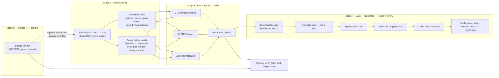

# Master Handoff: Unsupervised Discovery of Failure Axes in Driving VLAs

> **Version**: v2.0 · **Date**: 2026-09-28 · **Status**: plan of record for the Fall 2026 sprint
> **Supersedes**: the notebook-generated "Master Handoff Prompt" (v1). v1 had factual errors, listed in §0.1.
> **Team**: Jerry Yan (Zihao Yan), Chris, Catherine Wang, Hiram Lannes, Jason: UC Berkeley CDSS Data Discovery program (called "CDSS 170" in this repo; see §1.5)
> **Industry mentor**: Ryan Lingo, Applied AI Research Engineer & Developer Advocate, **99P Labs / Honda Research Institute USA** (not Toyota Research Institute)
> **Companion documents**:
> - [`CITATION_AUDIT.md`](CITATION_AUDIT.md): every citation, number, contact and deadline in this plan, verified with evidence links
> - [`DRIVING_VLA_LITERATURE_REVIEW.md`](DRIVING_VLA_LITERATURE_REVIEW.md): the corrected AutoVLA / Bench2Drive literature review
> - [`../references.bib`](../references.bib): corrected and extended BibTeX

---

## 0. How to Use This Document

**Who it is for.**
- An **orchestration AI agent** (paste the prompt in §0.3 and point it at this file).
- The **team lead**, who uses §8–§9 for weekly planning.
- The **mentor**, who reads §1, §2 (the D1–D9 decisions to ratify), §9.1 and §11.

**Reading order.** Read §0.1, then §1, §2 and §9 for the plan and schedule. Read §4 and §5 before building anything. §6 and §7 give the literature context. The appendices hold the data contracts and metric definitions.

**Conflict rule.** Where this document conflicts with older files in `docs/`, this document wins. The known conflicts are listed in §0.2.

### 0.1 Corrections to the v1 handoff prompt

Every correction below was checked against primary or strong secondary sources on 2026-09-28. Evidence is in [`CITATION_AUDIT.md`](CITATION_AUDIT.md).

| # | v1 said | Corrected | Consequence for the plan |
| :-- | :--- | :--- | :--- |
| 1 | Mentor: Ryan Lingo, **Toyota Research Institute** | **99P Labs / Honda Research Institute USA** (Applied AI Research Engineer & Developer Advocate) | Mentor asks rewritten around his actual expertise: evaluation, synthetic data, HRI-US data and publication process (§11) |
| 2 | Compute: "**LBNL Salvo** GPU clusters" | No LBNL cluster named Salvo exists. It is probably UC Berkeley's **Savio**. LBNL's GPU systems (Lawrencium/Einsteinium) and NERSC Perlmutter need an LBNL or DOE PI. | Compute plan in §1.5; securing access is a W0 action |
| 3 | Simulator: "CARLA **or Drake**" | **CARLA 0.9.15 + Bench2Drive + ScenarioRunner.** Drake is a robotics dynamics toolbox; its automotive module was deprecated in 2019, and it has no towns, traffic, pedestrians or weather. | Drake removed |
| 4 | VLA candidates: "DriveVLM, SimLingo, or OpenVLA/π₀ variants" | **SimLingo** is the only candidate that releases weights, training data, training code, a CARLA closed-loop agent and data-collection scripts. DriveVLM has **no public weights or code**. OpenVLA and π₀ are manipulation models; the only π₀-style driving policy is the third-party **Drive-π0** (DriveMoE repo). | D1/D2 in §2 |
| 5 | Target venues: "AAAI / ICRA / IROS / T-IV / CVPR", with "December: writing & submission" | **AAAI-27 (Jul 28), ICRA 2027 (Sep 16) and ICLR 2027 (Sep 25) deadlines have passed.** CVPR 2027 (Nov 16) and IEEE IV 2027 (Nov 15) fall **before** December. The only archival deadline in December is **RSS 2027 Stage 1 (Dec 4, 2026, AoE)**. | Venue plan in §1.4 |
| 6 | MMDiff contact: "Hugo Buurmeijer & Sonia Joseph (Oxford / Prisma)" | **Wrong people.** MMDiff is by Batra, Naghashyar, Khakzar, Torr, Schroeder de Witt, Venhoff and Clark (Oxford/Microsoft). Buurmeijer is at Stanford; Joseph (Prisma) is at Mila/McGill. | Contacts fixed (§10) |
| 7 | CARD: "AAAI 2026", "Stuttgart ToM Lab", with steering hooks and scripts available | CARD is an **arXiv preprint (Aug 2026)** by Majumdar, Kögel and Bulling (Collaborative AI group, U. Stuttgart). It studies **VLMs, not VLAs**. Its headline result is **negative** (belief steering does not move actions). No public code. | Used only as a causal-check template (§4.3) |
| 8 | Buurmeijer et al. studied "OpenVLA, π₀, π₀.5" | v1 of that paper verifies **OpenVLA and π₀.5**; v2 says "four VLAs" without a list we could reach. π₀ is unconfirmed. No public code. | Contact ask fixed |
| 9 | RoboART "uses VLMs to score degradation across human-enumerated factor lists (lighting, weather)" | RoboART (*Predictive Red Teaming*, Majumdar et al., **CoRL 2025**) uses **Imagen 3 image edits** plus a **conformal anomaly detector in the policy's own embedding space**. It works on **manipulation** (bimanual Kuka, diffusion policies), with 12 author-chosen off-nominal conditions (levels of a few factors: lighting colour, background colour, distractor objects, a person by the table, table height) and **no weather**. No code. | Baseline B2 redefined as a faithful driving port (§5.1) |
| 10 | VILTA: an external VLM "edits trajectory waypoints ... scene-graph level" | Confirmed AAAI 2026. The VLM (Gemini-2.5-Flash) edits one agent's future trajectory from BEV + state input. The ego is an **RL policy, not a VLA**. No code. | Optional baseline and contrast only |
| 11 | PHASER is "the continual-learning engine" | PHASER is real (arXiv 2606.03598) but is a **manipulation (LIBERO)** continual-learning method with **no public code**. | Default to plain 1:1 replay; PHASER-style replay is optional (§4.4) |
| 12 | "8-Stage Data Engine loop" established by "BMW, Carbon Robotics, Ocado, **Ansvar AI**" | **No public source defines this loop.** Ansvar AI is a legal/compliance data company, not physical AI. | Present the loop as **our own abstraction** (§3) |
| 13 | Tesla: "Karpathy Fleet Architecture, HW2/HW3 shadow mode, manual trigger classifiers" | "Karpathy Fleet Architecture" is not a real term. Shadow mode dates from **HW2 (Oct 2016)**. CVPR 2021 WAD keynote: **221 manually implemented triggers**; learned "approximate triggers" at ScaledML 2020. | Cite the specific talks (§6 Group C) |
| 14 | Person 4 builds the answer key **and** the RoboART factor list **and** scores all methods | This breaks blinding: whoever holds the key must not shape a baseline's factor list. | Split duties (§5.1, §8) |
| 15 | Planted gap = withheld data | Withheld data does not always cause failures; the policy may generalize. Withholding also needs retraining. | Add a gap **efficacy check** before sealing (§4.2). Mode B (novel-by-construction) is the Fall default; withholding becomes Mode A, after Dec 4 (D5). |
| 16 | Retraining success = failure-rate drop on the target axis | Without matched-volume controls this cannot show that *targeting* matters. | Add C-rand / C-text / C-RoboART / C-behav / C-oracle controls (§4.4) |
| 17 | Baselines: RoboART + behavioural stratification only | Drops the team's own mandatory **Random** and **Human-taxonomy** baselines, and omits the input-embedding (Domino) and failure-detector-embedding (SAFE) baselines reviewers will ask for. | Baselines B0–B6 (§5.1) |

### 0.2 Known errors in older repo documents

Corrected versions are in `CITATION_AUDIT.md` and `references.bib`.

- **`docs/SIMLINGO_ANALYSIS.md`**: several table values were wrong and are fixed in this commit:
  - Bench2Drive TCP-traj success rate should be 20.45, not 38.18, for the variant without distillation.
  - The "Think2Drive 67.45/54.09" row does not exist in any source.
  - SimLingo-BASE is 85.94/66.82, not 85.12/67.73.
  - The LB2.0 RC/IS columns were wrong.
  - "<4 GB VRAM per rollout" has no source; one user report measures ~11.4 GB.
  - Its "OpenVLA-7B vs SimLingo" decision stands.
  - Its §5.2–§5.4 recipes (SAE width, an invented dataset category, feeding commentary to the judge, "500 targeted rollouts") are superseded by §4.2–§4.4 here; its errata banner says so.
- **`docs/feedback.md`, `docs/PROJECT_BRIEF_DIFF_AND_IMPROVEMENTS.md`**:
  - The recommendation to "prototype on OpenVLA-7B / DriveVLM" is superseded (D1).
  - The DRAMA description is wrong. DRAMA is 17,785 **2-second clips from Tokyo**, selected on the ego driver's braking response, not on "risk interventions". CAN steering/brake channels in the public release are unconfirmed. Access is on request for non-commercial use. It is **not** suitable for pre-training a CARLA policy.
  - The suggested Llama-3.2-Vision / Qwen2-VL captioners are not served on NRP; use a pinned `qwen3` or `gemma` model (D7).
- **`docs/LITERATURE_REVIEW.md`, `docs/PUBLISHABLE_PROPOSALS.md`**:
  - Several cited papers have wrong titles, venues or domains. For example, ProbeAct, VLA-FAIL, RESample, RoboMonkey and RoVer are **manipulation** papers, mostly **2025–2026 preprints**. SAFE is *Multitask Failure Detection for VLAs* (NeurIPS 2025).
  - The NeurIPS 2026 Interp4Discovery deadline (Sep 2) has **passed**.
  - Figures such as "> 85% precision" and "> 80% failure reduction" are **targets, not results**.
  - The Meteor query example `sun_altitude < 10 AND truck_occlusion = True` (SimLoop motivation in `PUBLISHABLE_PROPOSALS.md` and `refined proposals.md`) is not from Mobileye. Meteor forms its own hypotheses.
- **`docs/FUTURE_PLANS.md`, `docs/PUBLISHABLE_PROPOSALS.md`**: the NRP model roster (Llama-3-70B / Mistral) is out of date (§1.5). The "Salvo" compute claim appeared only in the v1 prompt, not in the repo docs.
- **`README.md`**: the venue labels for RESample, RoboMonkey and ReasonBreak were wrong, "> 80% failure reduction" read as a result, and the target badge (NeurIPS/ICRA) is out of date (§1.4). Fixed in this commit.

### 0.3 Copy-paste prompt for an orchestration agent

```text
You are the orchestration agent for "Unsupervised Discovery of Failure Axes in Driving VLAs"
(UC Berkeley CDSS Data Discovery x 99P Labs / Honda Research Institute USA; repo Imhaohao/99p).

Sources of truth, in priority order:
  docs/MASTER_HANDOFF.md (plan, roles, gates)
  docs/CITATION_AUDIT.md (verified facts, citations, contacts, deadlines)
  docs/DRIVING_VLA_LITERATURE_REVIEW.md (driving-VLA and benchmark background)
  references.bib

Term goal:
  (1) By the G3 decision on Fri 2026-11-06, produce blind, pre-registered planted-gap precision/recall
      for activation-based failure-axis discovery (M1-M3) vs baselines B0-B6 on SimLingo in
      CARLA 0.9.15 / Bench2Drive.
  (2) If G3 = GO, close at least one discovered axis in closed loop (targeted PDM-Lite data + LoRA repair,
      with matched controls) and support the RSS 2027 Stage-1 extended abstract (due 2026-12-04 AoE),
      unless G3 selects IEEE IV 2027 (due 2026-11-15) instead. If G3 = PIVOT, follow the matching
      row of MASTER_HANDOFF §9.1.

Hard rules:
  1. Never read, infer or request anything under sealed/, in P4-only metadata tables, or in Fail2Drive
     per-scenario SimLingo results before P4 reveals the key (planned Fri 2026-11-13; the Nov 3 scoring
     report shares only which axes matched which gap IDs). Full rules: MASTER_HANDOFF §13.
  2. Cite only works verified in CITATION_AUDIT.md; add new ones there with evidence first.
  3. Never present targets or aspirations as results.
  4. Every experiment = committed config under configs/ + a run record under results/.
  5. Respect role blinding (MASTER_HANDOFF §8): no test-outcome analysis before the methods-frozen-v1
     tag except by P4's frozen scripts, and no key-derived information to P2/P3/P5 before the key reveal.
  6. Main-result LLM/VLM calls use pinned open models on the NRP endpoint; closed APIs only for
     optional comparisons.
  7. If a gate criterion (MASTER_HANDOFF §9) is at risk, escalate to the team lead the same day;
     issues that involve sealed material go to P4 only.
  8. Recheck any deadline or model-roster fact older than two weeks before acting on it.

Weekly loop:
  read MASTER_HANDOFF §9 for the current week
  -> draft tasks per role P1-P5 with done-criteria from §4/§5
  -> dispatch
  -> check outputs against the gate criteria
  -> write logs/weekly/<date>-summary.md
```

---

## 1. Project Overview

### 1.1 Question and hypotheses

**Question.** Can we find the kinds of situations a driving policy struggles with, its **failure axes**, by reading the policy's own internal representations instead of testing against a human-written list of hard conditions?

- **H1 (discovery).** On a driving VLA with planted data gaps, discovery from activations (§4.3) recovers **interactional gaps (tier T2)** with higher recall at a fixed axis budget than:
  - random selection,
  - human taxonomy,
  - RoboART-style enumerated factors,
  - behavioural/output-only clustering,
  - input-embedding slice discovery,
  - external-VLM captioning,
  - failure-detector-embedding clustering.

  On control gaps (T0), the non-residualized activation variants and the baselines should be comparable.

  *Falsified if* the best activation method's T2 recall@10 does not beat the best baseline (decision rule in §9.1).
- **H2 (actionability).** Discovered axes that pass the describability gate can be turned into scenario parameters that **reproduce** the failure (failure rate ≥ 2× nominal and ≥ 30%).

  *Falsified if* reproduction rates for gated axes are no better than for random axes (B0).
- **H3 (closed loop).** Fine-tuning on data generated along a discovered axis lowers failures on the **held-out** planted slice more than **matched-volume** untargeted, text-proposed, or baseline-directed data does, with no regression on nominal Bench2Drive (lower 95% bound of ΔDS ≥ −2; §4.4).

### 1.2 Planned contributions and non-goals

**Contributions (if the results hold):**
- **C1:** a planted-gap harness for closed-loop driving VLAs, with a sealed, hash-committed answer key.
- **C2:** failure-conditioned activation discovery (contrastive diffing, SAEs, probe residuals) with action-residual orthogonalization and causal checks.
- **C3:** discovery → generation → repair in closed loop, with matched controls.
- **C4:** a head-to-head comparison against seven baseline families.

**Non-goals:**
- **Runtime failure *detection*.** This area is crowded: SAFE (NeurIPS 2025) plus a 2026 wave of detectors (§6 Group B).
- **Real-vehicle deployment**, or treating Bench2Drive numbers as "safety criteria".
- **Training a new VLA architecture.**
- **Track A (text knowledge system).** Dropped per the team brief. Confirm at G0 with the program staff and Ryan that a Track-B-only deliverable meets the course requirements.

**Known limitation.** Planted T2 gaps are expressible in the generator's parameters, so the harness tests recovery of *unlisted conjunctions*, not of factors that cannot be parameterized at all.

**Positioning in one sentence.** RoboART, Mobileye Meteor and Tesla's triggers all need someone, or some language model, to *name* a failure before data can be collected for it. We test whether the policy's activations can surface failure axes nobody named, and we score that claim against ground truth.

### 1.3 Outcome tree

These outcomes adapt the three in the team brief (`PROJECT_BRIEF_DIFF_AND_IMPROVEMENTS.md` §2), with one change to ratify at G0: the brief's Worst case ("axes not recoverable → negative result on the limits of representation probing") now falls under Middle (harness valid, H1 ✗), and Worst instead means the harness itself is invalid. A Discovery-only row covers a repair that fails or is unfinished by Dec 4. The G3 rule in §9.1 chooses between them.

| Outcome | Condition | Paper |
| :-- | :-- | :-- |
| Best | H1 ✓, H2 ✓, H3 ✓ | Full method paper: discovery + repair |
| Discovery-only | H1 ✓, H3 ✗ or unfinished by Dec 4 | Discovery paper with an honest repair result; still RSS Stage 1 (finish H3 for Stage 2 or T-IV) |
| Middle | Harness valid, H1 ✗ | Comparative study: "When do internal representations beat external data directives?" |
| Worst | Harness invalid (gaps do not cause failures) | Benchmark / negative-result paper on planting failure gaps in closed-loop driving |

### 1.4 Venue plan (verified 2026-09-28; recheck before submitting)

| Venue | Deadline | Status | Fit |
| :-- | :-- | :-- | :-- |
| AAAI-27 main | Jul 28, 2026 | **Passed** | — |
| ICRA 2027 | Sep 16, 2026 (extended) | **Passed** | Reachable only via RA-L transfer by Dec 31, 2026, which is not realistic |
| ICLR 2027 | Sep 25, 2026 | **Passed** | ICLR 2027 workshops (≈ Feb 1, 2027, non-archival) remain |
| NeurIPS 2026 main | May 6, 2026 | **Passed** | — |
| NeurIPS 2026 Interp4Discovery workshop (non-archival) | Sep 2, 2026 | **Passed** | — |
| **IEEE IV 2027** (Perth, Jun 15–18, 2027) | **Nov 15, 2026**, 6 pages | Open | Most on-topic flagship. Nine days after G3, so it needs parallel writing from Oct 26. Best for a discovery-only or comparative (Middle outcome) paper. |
| CVPR 2027 (Seattle) | Registration Nov 10, paper Nov 16, 2026 (AoE) | Open | Very high bar; discovery-only; not recommended unless results are exceptional |
| AAAI-27 workshops (Montréal, Feb 22–23, 2027) | ≈ Nov 20, 2026 (varies by workshop) | Open | Non-archival, in person; list posted ≈ Oct 2 |
| **RSS 2027 Stage 1** (Athens, Jul 6–11, 2027) | **Dec 4, 2026 AoE**: 6-page extended abstract | Open | **Recommended primary.** The only archival deadline in December. Invited papers submit an 8-page Stage-2 paper by Apr 16, 2027, which leaves time to finish H3. |
| IEEE RA-L | Rolling | Open | Submit in December → IROS 2027 presentation via transfer (window closes Apr 30, 2027) |
| IROS 2027 (Florence) | Mar 1, 2027 | Open | Fallback archival conference |
| ICML 2027 / ICCV 2027 / ITSC 2027 (Boston) | ≈ late Jan / ≈ early Mar / ≈ Mar 1, 2027 (**estimated**) | Not yet announced | Later options |
| IEEE T-IV | Rolling | Open | Journal version (full closed-loop results) |

**Recommendation.** Plan for **RSS 2027 Stage 1 (Dec 4)** as the archival target. At G3, decide whether to redirect to **IEEE IV 2027 (Nov 15)** instead; this is the natural choice if the outcome is Middle or Worst. **Do not submit substantially the same work to both**: the IV review (notification Jan 15) overlaps RSS Stage 1. Non-archival workshops (AAAI-27, ICLR 2027) can run in parallel if each venue's dual-submission policy allows it. Present the course poster at the Data Discovery symposium in RRR week (confirm the date).

### 1.5 Compute, data and access (verified facts plus required actions)

| Resource | Verified facts | Action |
| :-- | :-- | :-- |
| **NRP Nautilus (primary)** | The CDSS Data Discovery program runs a DataHub on NRP with one GPU per user; interactive pods are capped at 16 CPU / 32 GB / 6 h, so rollouts must run as **batch Jobs**. Freely requestable GPUs include RTX A6000, A40, L40, A10, 3090/4090 and V100. **A100 needs an access request** (default quota 0); H100/H200 are not user-requestable. | P1 files the A100 quota request in W0 and verifies that CARLA runs off-screen in NRP pods |
| **NRP LLM gateway** `https://ellm.nrp-nautilus.io/v1` | OpenAI-compatible (an `/anthropic` path also exists). Tokens are self-generated at nrp.ai/llmtoken after joining the namespace. The Sep 2026 roster includes vision-capable `qwen3`, `qwen3-small` and `gemma` (Gemma-4-31B). The roster **rotates**. | Pin model IDs and log checkpoint names in every gate run |
| UC Berkeley **Savio** (the likely meaning of "Salvo") | savio4_gpu (A5000, L40) and savio3_gpu (A40, V100, …). Access requires a **faculty Faculty Computing Allowance** or a condo. | Ask the program staff / a faculty sponsor in W0 |
| LBNL Lawrencium/Einsteinium, NERSC Perlmutter | Need an LBNL PI or a DOE-allocated project | Pursue only if someone on the team has such a sponsor |
| **Budget (estimates)** | See the sub-list below the table | If fewer than ~8 A100/A6000-class GPUs are available for W3–W4, shrink `R_test` (G1 decides) |
| **Licences** | See the sub-list below the table | Ryan to confirm compatibility with the 99P/Honda sponsorship (§11) |
| Honda / HRI-US data | See the sub-list below the table | Optional real-world describability check only (§11) |

**Budget detail (estimates):**
- *Rollouts:* SimLingo runs at about 0.05–0.065× real time on an RTX 4060 Ti, with ≈ 11 GB whole-GPU usage including the CARLA server (user report, issue #95). A third-party fork (zhumorui/simlingo_f2d) reports ≈ 60 min wall-clock per 300 game-seconds on an A6000 with `inference_skip=5`, i.e. the VLM runs every 5th frame and controls are reused in between. That is not the released agent's configuration, so expect lower throughput with per-frame inference and fix the budget from the G1 measurement. Thousands of rollouts (`R_dev`, `R_test`, plus P4's efficacy pilots at ≈ 60 rollouts per candidate tried) therefore cost **≈ 300–1,000 GPU-hours**.
- *Closed loop (W6–W8):*
  - reproduction tests at ≈ 50 rollouts per gated axis;
  - B2 sim-rendered factor rollouts (factors × levels × runs);
  - held-out gap-slice and other-gap rollouts for every repaired checkpoint;
  - bench2drive220 regression for the targeted model.

  Recompute at G1 from measured throughput. Cut conditions and seeds before cutting slice sizes.
- *Mode-A retraining:* **≈ 192 A100-80GB-hours per model** (paper: 14 epochs on 8×A100 in 24 h).
- *SAE training on d = 896 activations:* tens of GPU-hours.
- *Storage:* 5–10 TB for datasets plus ~150 GB for activations and images.

**Licence detail:**
- SimLingo code: Apache-2.0.
- **SimLingo dataset: Wayve non-commercial licence.**
- Bench2Drive: CC-BY-NC-ND.
- AutoVLA: academic-only (no transfer of derivatives).
- DriveMoE: no licence file.

**Honda / HRI-US data detail:**
- DRAMA: 2-second Tokyo clips (left-hand traffic).
- HDD: 104 h, CAN, driver-behaviour and cause layers.
- Both are available **on request** for non-commercial use with a university email.

> **Course-number caveat:** "CDSS 170" appears only in this repo. Public sources describe the *Data Discovery course* (3–4 units, RRR-week poster symposium). Confirm the number before using it in a paper acknowledgment.

---

## 2. Decisions

### 2.1 Locked (ratify at G0, Fri Oct 2)

| ID | Decision | Rationale (verified) |
| :-- | :-- | :-- |
| **D1** | **Primary policy: SimLingo** (CVPR 2025; InternVL2-1B = InternViT-300M-448px + Qwen2-0.5B-Instruct; LLM LoRA r = 32, α = 64) | See the notes below the table |
| **D2** | **Secondary policy (stretch): Drive-π0** from the DriveMoE repo (CVPR 2026; PaliGemma-3B + flow-matching action expert; HF `rethinklab/DriveMoE`; Bench2Drive DS 65.85 for Base-fp32 and 67.41 for Full-fp32). **Non-VLA control (stretch): LEAD/TransFuser-v6** (CVPR 2026, MIT licence). | See the notes below the table |
| **D3** | **Simulator: CARLA 0.9.15 + Bench2Drive (bench2drive220) + ScenarioRunner route XML** | Every candidate policy targets this stack. Route XML sets per-scenario parameters and weather; OpenSCENARIO parameters can be overridden with `--openscenarioparams`. |
| **D4** | **SimLingo runs without Commentary/CoT** in the main campaign; CoT-on is an ablation | Paper Table 10: 84.41 ± 1.76 DS without CoT vs 85.07 ± 0.95 with it. The difference is within noise, and skipping CoT removes a text-generation pass from every step. |
| **D5** | **Gap planting: Mode B only for the Fall 2026 deliverables** (§4.2). Mode A (withholding) comes after Dec 4 (RSS Stage 2 or T-IV). It needs its own key (`key-sealed-v2`) drawn from slices present in SimLingo's training data and disjoint from `key_v1`, an exclusion manifest from P4 that P1 applies without reading, gapped + control retrains, a new `R_test`, and its own single scoring run. | Mode-B gaps are absent from the training data by construction, so they cannot be withheld. Mode A costs ≈ 400 A100-h and a full second discovery round. |
| **D6** | **Discovery layers are chosen by a layer sweep on the `R_dev` pilot only** (pre-registered at G1, Oct 16, before `R_test` logging starts) | Keeps the test set blind; `R_test` logs only the selected layers |
| **D7** | **Describability VLM: a pinned open model on NRP** (e.g. `qwen3` or `gemma`); GPT-4o/Gemini only as an optional comparison | Reproducibility and cost |
| **D8** | **Scoring: one Hungarian matching over all gaps on failing-rollout Jaccard, θ = 0.5, budget M = 10; recall reported per tier**; threshold-free metrics also reported (§4.2, Appendix B) | Rigour; pre-registered |
| **D9** | **Repair: LoRA (SimLingo's native path) + 1:1 uniform replay**; PHASER-style phase-aware replay optional | PHASER has no public code and targets manipulation |

**Why SimLingo (D1).**
- It is the only open driving VLA that ships weights (HF `RenzKa/simlingo`), the full PDM-Lite **training dataset** (HF, Wayve non-commercial), training configs, **Bench2Drive closed-loop code** and data-collection scripts, all on CARLA 0.9.15.
- Bench2Drive: **85.07 ± 0.95 DS / 67.27 ± 2.11 SR** (v0.0.3; v0.0.4 reports 86.55 / 70.45).
- Small enough to hook cheaply.

**Why Drive-π0 and LEAD (D2).**
- Drive-π0 tests whether the method transfers across architectures.
- It is trained on **open Bench2Drive data organised as `scenario/Town_weather_route` folders**, so withholding a slice is just a folder filter.
- Full fine-tuning needs A100-80GB/H100-class GPUs, so use its released weights unless cluster time exists.
- **Not chosen:** AutoVLA (no CARLA agent or code, academic-only licence, CoT data unreleased); ORION (7B-class, 32-GPU training configs; rollout-only at most); DriveVLM (no weights); LMDrive (CARLA 0.9.10.1).

### 2.2 Open (owner, due date)

| ID | Question | Owner | Due |
| :-- | :-- | :-- | :-- |
| O1 | Confirm the role → person mapping in §8 and name the **team lead** (weekly planning; receives §0.3 rule 7 escalations) | Team | G0 (Oct 2) |
| O2 | Compute source beyond NRP: Savio sponsor? 99P/HRI credits? | P1 + Ryan | Oct 9 |
| O3 | Venue: RSS 2027 Stage 1 vs IEEE IV 2027 | Team + Ryan | G3 (Nov 6) |
| O4 | Is the SimLingo dataset licence (Wayve non-commercial) compatible with the 99P/Honda sponsorship and with publishing repaired checkpoints? | Ryan (routes to HRI-US legal/IP as needed) | Oct 16 |
| O5 | Budget for a closed-API VLM comparison (GPT-4o/Gemini) | Team | Oct 16 |
| O6 | Mode A timing and compute (default: after Dec 4; see D5) | P4 + P1 + Ryan | G3 (Nov 6) |

---

## 3. System Architecture



**Our 8-stage abstraction of an industrial data engine.** This is our own synthesis, not an external standard; the concrete industrial instances are Tesla's data engine (2019–2021 talks) and Mobileye Meteor/Genario (2026).

| Stage | Industry (Tesla / Mobileye) | This project |
| :-- | :-- | :-- |
| 1 Log capture | Fleet clips; shadow mode | Closed-loop CARLA rollouts + activations |
| 2 Grouping | Hand-written triggers (221 at CVPR 2021); Meteor's multi-agent mining | **Unsupervised activation discovery (M1–M3)** |
| 3 Naming | Engineers; Meteor's vision-language reasoning agent ("a scenario the agent can name") | Describability gate, run **after** grouping; naming is not needed to find the axis |
| 4 Retrieval | Fleet queries; embedding search | Rollout sets per axis |
| 5 Synthetic generation | Genario photo-realistic variations | Route-XML scenario sampling + PDM-Lite expert |
| 6 Validation | Reproduce the failure | Reproduction test (§4.4) |
| 7 Retraining | Fleet retraining | LoRA + replay |
| 8 Regression check | Shadow-mode validation | Bench2Drive-220 non-inferiority |

---

## 4. Experimental Design

Each stage lists inputs, procedure, outputs and pass criteria. Parameters marked **(pre-register)** are committed to `harness/PREREGISTRATION.md` and tagged `prereg-v1` at **G1 (Fri Oct 16)**, before the key is sealed and before `R_test` launches.

### 4.1 Stage 1: Rollouts and activation logging (owner: P1)

**Policy configuration.** Released SimLingo checkpoint with Commentary off (D4). Record the Bench2Drive version (v0.0.3 vs v0.0.4 numbers are not comparable) and the checkpoint hash.

**Simulator.** CARLA 0.9.15, synchronous mode, fixed time step, Bench2Drive harness. Every rollout records `(route_id, scenario_type, scenario_params, weather, town, seed, carla_version, policy_ckpt_sha256)`.

**Rollout pools.**

| Pool | Purpose | Composition | Size | Metadata visible to |
| :-- | :-- | :-- | :-- | :-- |
| `R_nom` | Reproduction + regression | bench2drive220 (44 scenarios × 5 routes) | 220 × 3 seeds | everyone |
| `R_dev` | Method development | Bench2Drive-style short routes across scenario families, with weather × town jitter, plus **2 public practice gaps** (the §4.2 example predicates) | 600–1,000 | everyone |
| `R_test` | Blind scoring | Same generator plus **4–6 sealed gaps** and **2 decoy families**. P4 injects each at 4–8% of `R_test`; all injected slices together are ≤ 40%, and each slice is ≥ the power-analysis n and ≥ 60 rollouts. `R_dev`'s practice-gap regions are excluded. | 1,500–2,500 (budget fixed at G1) | activations, outcome and failure-type labels, front RGB + BEV frames (for the gate, B4 and B5), and PDM-Lite shadow residuals. **No** scenario metadata, route XML, per-frame privileged state or structured summaries until the key reveal. |
| `R_gen` | Closed-loop data | Scenarios sampled from reproducing axes | 5k / 20k / 50k expert frames per axis | everyone (after the key reveal) |

**Failure labels (dense, per frame).**
1. **Infraction events** from the CARLA/Bench2Drive criteria: collisions (vehicle / pedestrian / layout), red light, stop sign, off-road, route deviation, agent blocked, yield-to-emergency-vehicle, timeout. Log CARLA's minimum-speed infraction but do not count it as a failure, since Bench2Drive (≥ v0.0.2) excludes it from DS, SR and ability scores. The failure window is `[t_event − 3 s, t_event]` **(pre-register)**.
2. **Near misses:** minimum TTC < 1.5 s. Hard deceleration is logged as a feature, not a failure label, because correct emergency braking would otherwise count as failure.
3. **Expert disagreement:** query the privileged PDM-Lite planner in **shadow mode** on the same state and log `‖policy_wp − expert_wp‖`. *Engineering risk:* confirm PDM-Lite can plan without controlling the ego; otherwise use only 1 + 2.

**Rollout failure (pre-register).** A rollout **fails** iff Bench2Drive marks it unsuccessful: any counted infraction or a timeout, i.e. it does not count toward SR. This is the unit behind `F(g)`, `R(a)`, efficacy, reproduction and remediation. Near misses and expert disagreement are dense per-frame labels used only for failure windows and axis cards.

**Hook sites.** SimLingo's LLM is Qwen2-0.5B (24 decoder layers, hidden size 896; confirm from the loaded config).

| Site | Tokens logged | Why |
| :-- | :-- | :-- |
| LLM residual stream: every layer (pilot) → 2–3 selected layers (main) | path-query tokens `q_p` and speed-query tokens `q_w` | Action bottleneck: the waypoint MLPs read only these |
| Same layers | 512 visual tokens (2 tiles × 256) → mean-pool + top-k attention-pool | Perception content; needed for residualization |
| Same layers | speed / navigation prompt tokens | Conditioning state |
| Vision bridge (projector output) | pooled | Pre-LLM perception. Grant et al. (2026) find the visual pathway dominates action generation in VLAs. |
| Outputs | path waypoints (1 m spacing), speed waypoints (0.25 s spacing), PID commands | Behavioural baseline B3 and failure typing |
| Camera + BEV | front RGB (JPEG) + semantic BEV at the logging rate | Gate and baselines B4/B5 |

Include early, middle and late layers in the sweep. On ORION, navigation commands are linearly decodable after layer 1, but planning-relevant information matures late (Babu et al. 2026).

**Storage.** `bytes/frame ≈ L × T × 896 × 2` (fp16). The pilot logs all 24 layers × ~35 token-vectors ≈ 1.5 MB/frame. The main campaign logs 3 layers ≈ 190 KB/frame, i.e. ≈ 70 GB for 2,500 rollouts. Use per-rollout Zarr/Parquet shards plus an SQL index (`rollouts`, `frames`, `events`). Blinded metadata lives in a P4-only table.

**Lossless replay inputs.** For every frame that may be used in replays or causal checks (at least all failure-window frames and the G1 determinism set), store the exact preprocessed model input losslessly (PNG or the uint8 tensor) plus the speed and navigation inputs. JPEG is used only for gate, B4 and B5 thumbnails.

**Gate G1 (Fri Oct 16).**
- (a) Reproduction on bench2drive220 with 1 seed, **Commentary/CoT off** (D4): **DS ≥ 75**. The paper's CoT-off figure is 84.41 ± 1.76 (Table 10; 85.07 ± 0.95 with CoT). The only public reproduction report we found (issue #43: one user, 219 routes, no maintainer reply, configuration unconfirmed) got DS 75.5 / SR 67.1. Below 75, debug before going on.
- (b) Hook determinism: replaying a logged frame offline reproduces the logged waypoints to < 1e-3 m.
- (c) Measured throughput, and a fixed `R_test` size.

### 4.2 Stage 2: Planted-gap harness (owner: P4, sole key holder)

**Definitions.**
- A **gap** `g` is a predicate over scenario-parameter space: scenario family, actor types, kinematics, occluders, ego state, weather, town/road type.
- **Slice** `S(g)`: the `R_test` rollouts that satisfy the predicate.
- **Failure set** `F(g)`: the failing rollouts inside `S(g)`.

**Two planting modes.**

| Mode | How | Cost | Validity |
| :-- | :-- | :-- | :-- |
| **B: novel-by-construction** (Fall 2026 default) | Use the released checkpoint. Gaps are scenario regions **absent from SimLingo's released training data**: Fail2Drive's unseen scenarios and novel assets (IROS 2026; CARLA 0.9.15; SimLingo is among the evaluated models), plus P4-built parameter regions outside SimLingo's collection distribution. P4 checks absence against the released dataset and collection configs (spawn-distance jitter ±10%, weather augmentation, Towns 1–10/12/13). | ≈ 0 GPU-h | Strong for unseen-condition gaps. P4 documents the out-of-distribution rationale for every gap. |
| **A: withholding** (gold standard; after Dec 4, see D5) | Remove the gap slices from SimLingo's released dataset (≈ 16k routes and ≈ 2.04M images in the "all" bucket, per issue #76). Also drop their VQA, commentary and dreamer labels. Retrain from InternVL2-1B, and train a **matched in-house full-data control** rather than comparing against the released checkpoint, because reproduction variance is large. | ≈ 192 A100-h per model (paper recipe); the released config differs (global batch 64 vs 96) | Matches the "data gap" hypothesis exactly. It also allows **model diffing** between the gapped and control models (optional method M4). |

**Blinding for Mode B.** Fail2Drive publishes per-scenario results for SimLingo. P2, P3 and P5 must not consult them before the key reveal.

**Gap tiers in the test key (K = 4–6), plus decoys.**
- **T0 control (1–2):** perceptual or environmental, e.g. a weather/lighting preset family or a Fail2Drive visual-noise asset. Every competent method should find it. If none does, the harness is broken.
- **T1 enumerable (1):** one factor that any reasonable list would name, e.g. one novel actor type or one scenario family.
- **T2 interactional (2–3):** conjunctions or sub-ranges no standard list names, for example:
  - a `HighwayCutIn` only when the cut-in gap is < X m **and** the relative speed is > Y m/s;
  - a `ParkingCrossingPedestrian` only when ego speed is > Z m/s;
  - an `InvadingTurn` with the oncoming vehicle occluded.

  **The main claim is about T2.**

  These example predicates, and those in Appendices A.3 and A.4, are **public illustrations**. They may serve as the `R_dev` practice gaps and are **excluded** from `key_v1`. §7's family list and R4's ability list describe only the public search space. P4 draws the sealed T2 predicates (sub-ranges or conjunctions not written in any shared document) from a candidate pool recorded only in `sealed/`.
- **Decoys (2):** one visually novel family and one kinematic region outside SimLingo's collection distribution. Each must have a failure rate within ±5 pp of its neighbourhood, checked like efficacy. They stop "novelty" from standing in for "failure".

**Efficacy check (P4 only, before sealing).** A candidate counts as a gap only if the policy actually fails more inside it. Require all of **(pre-register)**:
- a failure-rate uplift of ≥ 20 pp **and** a ratio ≥ 2× over the matched neighbourhood (same family, parameters outside the gap), so that the gap-attributable share of `F(g)`, 1 − p_nbhd/p_in, is ≥ 0.5;
- Fisher exact p < 0.01;
- ≥ 30 rollouts in the slice.

Replace candidates that fail before sealing, and report how many candidates were tried. Pilots are noisy (winner's curse), so G3 re-confirms efficacy on `R_test` (§9.1).

**T2 validity (pre-register).** Using the planned `R_test` composition and the pilot failure rates, P4 verifies that no single-factor B1 stratum has expected Jaccard ≥ 0.4 with `F(g)`. If one does, lower the gap's prevalence, raise its parent family's out-of-gap share, or re-tier the gap as T1.

**Background-failure warning.** SimLingo already fails often in interactive abilities. Bench2Drive multi-ability success rates (paper Table 8):

| Merging | Overtaking | Emergency Brake | Give Way | Traffic Sign |
| :-- | :-- | :-- | :-- | :-- |
| 54.0% | 57.0% | 88.3% | 53.3% | 82.5% |

Give Way covers only 2 scenario types (10 routes), so it is noisy. Natural failures will dominate `R_test`, so size prevalence and rollout counts with a **power analysis on `R_dev`**.

**Sealing protocol.**
1. P4 writes `sealed/key_v1.json` (predicates, tiers, prevalence, efficacy statistics, out-of-distribution rationale). `sealed/` is git-ignored.
2. **Seal before `R_test` launches (Mon Oct 19).** P4 commits `sha256(key_v1.json ‖ salt)` to `harness/KEY_COMMITMENT.txt` and tags `key-sealed-v1`. When `R_test` completes, P4 also commits the sha256 of the P4-only per-rollout metadata export.
3. **Freeze, then run.**
   - Code, configs and all `R_dev`-fitted artefacts are committed and tagged `methods-frozen-v1` before any method reads `R_test` outcome labels.
   - A committed script then fits the transductive parts (the SAE on unlabeled `R_dev ∪ R_test` activations, M3a residuals), runs every method and baseline on `R_test`, and commits `results/test/<method>/axes.json` (tag `test-outputs-v1`).
   - Any change after `methods-frozen-v1` is a new, reported version.
4. **Scoring (Tue Nov 3).** P4 runs the single scoring run and publishes a scoring report: per-tier metrics, and which axis IDs matched which gap IDs and tiers. It does **not** include predicates or the salt. **Scoring runs once**; later reruns are labelled *post hoc*.
5. **Key reveal (Fri Nov 13, end of W6).** P4 reveals the key and salt only after two things are committed:
   - (i) causal-check results, with pre-registered α and control directions;
   - (ii) `scenario_spec.json` for every gated axis, including the H3 target axis.

   P4 chooses the H3 target by a pre-registered rule and announces only its axis ID: the highest-ranked gated, causally supported axis of the primary activation method that matched a P4-built (non-Fail2Drive) T2 gap. After the reveal, anyone can check the hash. P4 builds `C-oracle`. Specs changed after the reveal are labelled post-hoc variants.

**Scoring (pre-register; Appendix B).**
- **Axes.** Each method outputs a ranked list of at most **M = 10** axes; clusters are ranked by failure-rate lift × support.
- **Axis rollout sets `R(a_j)`.**
  - *Score-based methods:* the failing `R_test` rollouts whose axis score, within the failure window, exceeds the 95th percentile of that score over `R_dev` success windows.
  - *Cluster, stratum and factor methods:* the members.
  - *B1/B2/B2+:* P4 computes membership from sealed metadata. Factor levels not expressible in it get `R = ∅`.
  - *B0:* draws its set sizes from the primary activation method's axis sizes.
- **Matching.** One Hungarian assignment over **all K gaps**, with cost `1 − Jaccard(F(g_k), R(a_j))`, minimized; equivalently `scipy.optimize.linear_sum_assignment(J, maximize=True)` on the Jaccard matrix. Gap and decoy slices are disjoint by construction.
- **Report:** `Recall@M` per tier (T0/T1/T2), `Precision@M` (always divided by M = 10), mean best Jaccard, per-gap attributable share, per-gap AUROC (score-based methods only), and the decoy hit rate (Appendix B).
- **Unmatched axes are not automatically errors.** Axes that pass the reproduction test (§4.4) count as *validated natural axes*. They are reported through a secondary "validated precision", computed after the W6 reproduction tests.

**Statistics.**
- **Seeds.** Each method has one pre-registered primary config. Stochastic methods run 3 seeds and scores are averaged over seeds; B0 is averaged over 1,000 draws.
- **Primary test.** §9.1 criterion 2 is a single test, so no correction is applied. Its CI comes from a bootstrap that resamples **routes** (clusters of rollouts), re-scores, and re-selects both "best" methods in every replicate.
- **Secondary.** Tier-wise comparisons are secondary, Holm-corrected and labelled exploratory. With only 2–3 T2 gaps, results are conditional on the planted gaps, so per-gap results are always reported.

### 4.3 Stage 3: Unsupervised activation mining (owner: P2)

**Inputs.** Activations at the selected layers for failure windows `W_f` and success windows `W_s`, plus outcome and failure-type labels. **No scenario metadata.** (M3a's `R_test` ground-truth state is handled only inside the frozen pipeline.)

**Preprocessing (ablated in §5.3).**
- **P-std:** per-layer standardization fitted on `R_dev` success frames.
- **P-resid (action-residual orthogonalization):** ridge-regress the action-query states on the pooled visual tokens, fitted on success frames, and keep `r = z_action − W·z_vision`. This removes "it's raining" directions so that clusters follow decisions rather than appearance.
- **P-nuis:** optionally project out the top principal components that predict town or weather on `R_dev`.

T0 recall and the T0 positive-control causal check use the **P-std (non-residualized)** variant of each method. Residualized variants are expected to miss T0 and do not count against harness validity.

**M1: contrastive activation diffing.** Inspired by MMDiff's per-token contrastive firing, adapted here from *task vs VQA* to *failure vs success*.
1. For each feature (neuron, PCA component or SAE latent), compute the standardized mean difference and the firing-rate log-odds between `W_f` and `W_s`.
2. Keep features at BH-FDR q < 0.05 with support ≥ 20 rollouts.
3. Merge co-firing features (firing-set Jaccard > 0.5) into axes, and rank by effect × support.

**M2: sparse-autoencoder latents.**
- **SAE:** TopK SAE (JumpReLU as an ablation) on the selected layer, raw and residualized. Dictionary 8×–32× of d = 896, with k = 32–64, trained on `R_dev ∪ R_test` frames.
- **Blinding:** unlabeled test activations may be used; **test outcome labels may not be used to tune the SAE**.
- **Health reporting:** report dead-latent fraction, explained variance, and waypoint error when SAE reconstructions are spliced back in.
- **Memorization filter:** apply Swann et al.'s (2026) generality-vs-memorization metric (code due 1 Oct 2026) before ranking, so episode-specific latents are not mistaken for failure axes.
- **Ranking:** rank latents as in M1 and merge co-firing latents.

**M3: probe-residual clustering.** The probe target list is frozen before sealing.
- **M3a, state-decoding residuals.** Following Buurmeijer et al.'s linear observers:
  1. Decode a **pre-registered generic state list** from activations, fitted on success frames: lead-vehicle distance and relative speed, nearest-pedestrian distance, traffic-light state, time-to-intersection, occlusion flag.
  2. Cluster the residual vectors (decoded − true state) on failure frames with HDBSCAN. On `R_test`, ground-truth state is privileged: the frozen pipeline computes the residuals by committed script after `methods-frozen-v1`, and P2 does not inspect state values before the key reveal. B3 receives the same per-frame state features, so no activation method gets covariates a baseline lacks.

  The result is a set of failure clusters grouped by what the policy mis-represents.
- **M3b, action residuals.** Cluster `(policy − PDM-Lite)` waypoint residuals jointly with activation projections. This separates "right perception, wrong decision" from "wrong perception".

**M4 (optional, Mode A only): model diffing.** Train SAEs or crosscoders (Lindsey et al. 2024) on the gapped model and the matched control, and find latents that differ between them. This is closest to MMDiff's original "model diff".

**Layer sweep (on the all-layer `R_dev` pilot, W2).** For each layer × site (action queries, pooled visual, vision bridge), measure:
- linear-probe AUROC for failure vs success windows;
- practice-gap recall of M1/M2 prototypes;
- probe R² for the state list.

Pick 2–3 layers before `R_test` launches **(pre-register at G1)**.

**Causal check (every top-M axis).** CARD's steer-one-axis/read-another protocol, plus Event-SAE's residual-preserving zero-out.
- **Projection removal:** on logged failure frames, replace `z` with `z − (z·v̂)v̂`, then measure the change in waypoints.
- **Steering:** add `α·v` to success frames and check whether the waypoints move toward the failure pattern. Buurmeijer et al.'s closed-form minimal additive controller gives a principled `α`.
- **Controls:** random directions with matched norm, and non-failure latents.

Axes whose effect is below the 95th percentile of the controls are marked **"correlational only"**. They are still scored but not prioritized for generation. CARD's own result shows that a linearly decodable direction can have **no** causal effect on actions, so treat a null result as informative. Planted T0 gaps serve as positive controls.

**Output.** Axis cards (Appendix A.2) in `results/<pool>/<method>/axes.json`.

### 4.4 Stage 4: Describability gate, generation and closed-loop repair (owners: P3, P5)

**Describability gate (P3; identical for every method and baseline).**
1. **Inputs:** for each axis, the top-10 failure keyframes (front RGB + BEV) and 10 contrast frames. Contrast frames are success frames with matched ego speed and road type, chosen from logged kinematics, not scenario labels.
2. **Description:** a pinned NRP vision model (D7) answers a contrastive prompt: *"What is present in group A and absent in group B? Describe scene elements, agent kinematics and occlusions, then fill the scenario schema."*
3. **Validation:** a **separate** text-only model gets only two things:
   - the description;
   - an auto-generated structured summary of each held-out rollout, built only from logged observations: actor classes, ego and actor speeds, inter-vehicle distances and TTC. Never from `scenario_type`, `scenario_params`, weather presets or other P4-only metadata; no gap labels.

   Held-out rollouts are those not used for the 20 keyframes, split by route. The model predicts which rollouts score high on the axis. **Pass if AUROC ≥ 0.70 (pre-register).**

   *Blinding on `R_test`:* a committed script inside the frozen pipeline generates the summaries and passes them straight to the text-only model. They are never shown to P2/P3/P5; before the key reveal, P3 sees only per-axis AUROC and pass/fail.

   *Reporting:* pass rates per method, plus two gate controls. B0 gives incoherent axes. A description-shuffle control scores each axis with another axis's description; **its pass rate is the gate's false-positive rate**.
4. The policy's CoT/commentary is **never** treated as ground truth. Distilled CoT is post-hoc rationalization: AutoVLA's teacher was *given* the ground-truth action, and human audits found 88.8% annotation accuracy.

**Scenario parameterization (P3).**
1. Map each description to a parameter *distribution* in the scenario schema (Appendix A.3).
2. Compile it to Bench2Drive/LB2.0 route XML (per-scenario trigger, direction, flow speed, spawn interval; per-route weather) or to OpenSCENARIO with `--openscenarioparams`.
3. Clip to physically plausible bounds, and have Ryan / HRI-US review them (§11).
4. ChatScene's Scenic retrieval pipeline is a reusable reference for language → scenario code.

**Reproduction test.** Run the current policy on 50 sampled scenarios. The axis **reproduces** if its failure rate is ≥ 2× the nominal rate and ≥ 30%. The nominal rate is the failure rate of the same scenario class under the default generator distribution on `R_dev`. If the G1 budget requires it, cap the test at the top-3 gated axes per method (including B0); validated precision is then computed over those axes only.

**Targeted data (P1 + P5).** Run the PDM-Lite expert on scenarios from reproducing axes, using routes and seeds disjoint from every evaluation set. Record SimLingo-format samples with the repo's collection scripts. The primary volume is **20k frames (pre-register)**. The 5k / 50k sweep applies to the targeted condition only and may move to RSS Stage 2. AutoVLA's data-scaling figure (Fig. 4) shows that volume matters: on nuPlan, CoT supervision trails action-only training up to 50k samples and overtakes it by 100k, and on nuScenes action-only is better at every scale.

**H3 targets and `C-oracle` use only P4-built parameter-region gaps.** Gaps built from Fail2Drive scenarios or assets are discovery-only, because Fail2Drive rule 1 forbids training or fine-tuning on its routes, scenario definitions or assets.

**Repair (P5).**
- SimLingo's native LoRA (r = 32, α = 64) on the LLM, vision encoder frozen, waypoint heads trainable.
- 1:1 mix of targeted and replay data, where replay is a uniform sample of the original training set.
- 3 seeds for the targeted condition.
- LoRA hyperparameters are fixed before targeted data is generated and are identical across conditions. Any retuning (R11) is applied to all conditions.

**Controls (identical frames and GPU-hours; 1 seed each at 20k frames in the Fall, extra seeds in RSS Stage 2).**
- `C-none`: no fine-tuning.
- `C-rand`: random scenarios.
- `C-text`: ChatScene-style, LLM-proposed hazards from a generic hazard list with no access to activations.
- `C-RoboART`: B2's worst factor levels.
- `C-behav`: B3's clusters.
- `C-oracle`: built by P4 from the true key predicates; its specs are withheld from P2/P3/P5 until the key reveal. It is the upper bound.

**Evaluation.**
1. Failure rate on **held-out** gap-slice routes (P4 keeps separate locations and seeds).
2. bench2drive220 × 3 seeds for regression **of the targeted model**, reporting DS, SR and per-ability SR. The base checkpoint (`C-none` = `R_nom`) is re-run under the same seeds in the same campaign. Non-inferiority holds if the lower bound of the one-sided 95% CI on ΔDS (paired by route and seed, bootstrap over routes) is ≥ −2 **(pre-register)**; the point estimate is also reported. Controls are compared on items 1 and 3 only.
3. Failure rates on *other* gaps, to separate targeted repair from generic improvement.

**H3 holds if**, at the pre-registered volume (20k frames), the targeted repair beats `C-rand`, `C-text`, `C-RoboART` **and** `C-behav` on the target slice (each by paired bootstrap over held-out routes, p < 0.05; all must hold) and passes non-inferiority.

---

## 5. Baselines, Controls and Ablations

### 5.1 Discovery baselines

All baselines use the same `R_test`, M = 10, the same gate and the same scoring. P4 scores every row but configures and runs none of them (fairness rule 4).

| ID | Baseline | Input | Axis construction | Why | Owner |
| :-- | :-- | :-- | :-- | :-- | :-- |
| **B0** | Random | rollout IDs | M random failing-rollout subsets, sizes drawn from the primary activation method's axis sizes | Chance floor (Catherine's Baseline 1) | Config P5; run P1 |
| **B1** | Human taxonomy | benchmark metadata (scenario family, weather, town, ability) | Top-M single-factor strata (scenario family, weather, town, ability) by failure rate (support ≥ 20) | Catherine's Baseline 2; standard practice | Config P3/P5; run P1 |
| **B2** | RoboART-style enumerated factors (faithful port) | a **pre-registered factor list** (≈ 8–15 factors × levels), frozen and hashed **before** gaps are designed | See the port description below the table | Primary literature baseline | List and config P3 with P5; run P1 |
| **B2+** | B2 + pairwise factors | same list | Top-M factor **pairs** | Answers "the factor list was weak" | Config P3/P5; run P1 |
| **B3** | Behavioural / output-only | action error vs PDM-Lite, kinematics, infraction type | HDBSCAN on failure windows, with the same per-frame state features M3a uses. KING's hand-analysed failure-mode clusters are the precedent. | Catherine's Baseline 3: do activations add anything over outputs? | Config P5 with P1; run P1 |
| **B4** | Input-embedding slice discovery (Domino) | CLIP/SigLIP embeddings of failure keyframes | Error-aware GMM, top-M slices | Internal vs generic perceptual representations | P2 (still blind) |
| **B5** | External-VLM captioning (Meteor-style) | failure clips → VLM captions | Cluster caption embeddings | Internal activations vs the surface-semantic industrial pipeline | P3 |
| **B6** | Failure-detector embedding (SAFE-style) | same activations | Train a SAFE-like success/failure detector, cluster its latent space | "Detection features ≈ discovery?", which reviewers will ask | P2 |

**B2 port (how RoboART translates to driving).**
- RoboART proper: open image editing of nominal frames per factor (InstructPix2Pix-class editors in place of the proprietary Imagen 3), plus a kNN anomaly detector in SimLingo's embedding space with conformal calibration. Predicted success = 1 − anomaly rate.
- The **sim-rendered** variant: render each factor natively in CARLA and measure the real failure rate. This is the stronger and fairer variant in simulation.
- Top-M factor levels become the axes.

**Fairness rules.**
1. P3 and P5 write B2's factor list **from public sources** (Bench2Drive's scenario list, CARLA weather presets, RoboART's factor categories) **before** P4 chooses gap candidates, and commit its hash at **G0 (Fri Oct 2)**.
2. P4 designs gaps by a pre-declared tier rule that does not look at the list.
3. Every method gets the same M, the same rollouts and the same gate.
4. **All B0–B3 configs are written by blind roles** (P3/P5 with P1) and committed and hashed by **Fri Oct 9**, before the gaps are finalized:
   - B1: single-factor strata of the public taxonomy, support ≥ 20;
   - B2: primary variant = sim-rendered, plus the editor, kNN and conformal settings for the image-edit variant;
   - B3: feature set, HDBSCAN parameters and ranking rule.

   P1 (or P5) runs them on `R_test` by committed script inside the frozen pipeline. P4 receives the B2 list only after `key-sealed-v1`, never edits a baseline config, and only scores.

### 5.2 Closed-loop controls

`C-none`, `C-rand`, `C-text`, `C-RoboART`, `C-behav`, `C-oracle` (§4.4). A VILTA-style adversary is **optional**, only if its authors share code: its ego is RL, not a VLA. CUPID-style influence attribution (Agia et al., CoRL 2025) is discussed rather than run. **Planted gaps are *missing* data, and attribution can only rank data that is present.** State this in the paper, and run it only if time allows.

### 5.3 Ablations

Run on `R_dev`; confirm the top 1–2 on `R_test` (layer ablations only among the logged layers).

- **Where to read:** layer (all 24 → selected) × site (action queries / pooled visual / prompt / vision bridge).
- **Preprocessing:** P-resid on/off; P-nuis on/off.
- **SAE settings:** width (8×/16×/32×), k, TopK vs JumpReLU, and the memorization filter on/off.
- **Temporal pooling:** window mean vs max vs last frame.
- **Data scale:** number of rollouts (250 / 500 / all of `R_dev`), i.e. the data-efficiency curve. A full-`R_test` point is post hoc.
- **Policy settings:** SimLingo CoT on/off; Mode A vs Mode B (after Dec 4, if Mode A runs).
- **Other policies:** Drive-π0 and LEAD/TFv6 (stretch).

---

## 6. Literature Testing Ground (verified)

Every entry below is verified in `CITATION_AUDIT.md`, and its BibTeX key is in `references.bib` unless the row says otherwise. **Threat** marks how close a work comes to scooping our core claim (§6 Group F).

### Group A: Mechanistic discovery and probing

| Work (key) | What it actually is | How we use it |
| :-- | :-- | :-- |
| **MMDiff**: *Multimodal Model Diffing for Feature Discovery and Control* (Batra, Naghashyar, …, Venhoff, Clark; Oxford/Microsoft; arXiv 2608.09928; ICML 2026 workshop poster) `batra2026mmdiff` | SAEs on MLLM residual streams. It diffs a base-LM SAE against its multimodal-adapted SAE, then finds task features by per-token contrastive firing against VQA and removes or steers them (spatial −12%, OCR −17%, jailbreak −24%). SAE weights on HF (`OX-PIXL/MMDiff_SAEs`); code "coming soon". | Template for M1; M4 is the literal "model diff". Our contrast is **failure vs success in closed-loop driving**, which is an adaptation. |
| **CARD** (Majumdar, Kögel, Bulling; U. Stuttgart; arXiv 2608.20763) `majumdar2026card` | Steers VLMs along one mental-state axis and reads another in the Relay Chain gridworld. **Negative result:** belief steering does not change actions. | Causal-check protocol; a reminder that a decodable direction may not be *used* |
| **Observing and Controlling Features in VLAs** (Buurmeijer, Amo Alonso, Swann, Pavone; Stanford/NVIDIA; arXiv 2603.05487) `buurmeijer2026observing` | Per-layer linear observers for **known** state/action features (OpenVLA, π₀.5), plus a closed-form minimal additive controller (LIBERO, DROID) | M3a observers; steering magnitude; a *supervised* contrast to our unsupervised discovery |
| **DR.VLA: SAEs Reveal Interpretable and Steerable Features in VLA Models** (Swann, …, Buurmeijer, Kennedy, Schwager; arXiv 2603.19183; CoRL 2026 per the authors) `swann2026sparse` | SAEs on π₀.5. Most features are memorized episodes; a generality metric separates them from general features. | **Must cite.** Memorization filter for M2. **Threat: MEDIUM.** |
| **Event-Grounded SAEs for VLA Policies** (Jin, Chatterjee, Kumar, Paleja; Purdue; arXiv 2605.17204) `jin2026eventsae` | SAE features ranked against behavioural events clustered from rollouts, with VLM labels and residual-preserving zero-out checks (OpenVLA, π₀.5) | Closest method precedent. Differentiate: **failure-conditioned**, planted-gap scored, driving, repair. **Threat: MEDIUM-HIGH.** |
| **Not All Features Are Created Equal** (Grant, Zhao, Wang; CWRU; arXiv 2603.19233) `grant2026notall` | Activation injection, SAEs and probes across 6 VLAs and 394k rollouts. The visual pathway dominates; contrastive concept identification. | Include vision-bridge sites in the sweep. **Threat: MEDIUM.** |
| **Mechanistic Interpretability for Steering VLAs** (Häon, Stocking, Chuang, Tomlin; UC Berkeley; CoRL 2025) `haon2025mechanistic` | Projects FFN value vectors onto the token vocabulary; steers π₀ / OpenVLA | Training-free naming of candidate directions; a **local Berkeley contact** |
| **Driving the Wrong Way** (Motzkus, Bernhard; arXiv 2607.06328) `motzkus2026driving` | TopK SAE inside the GTRS E2E planner; suppressing 3 neurons improves NAVSIM (open-loop) | Nearest *driving* SAE precedent; we are closed-loop, VLA, unsupervised discovery |
| **Words in Motion** (Tas, Wagner; ICLR 2025) `tas2025words` | Probes and SAE control vectors for motion-forecasting transformers | Prior driving-model interpretability |
| **Depth-Wise Probing of ORION's planning token** (Babu et al.; Bosch/KIT; arXiv 2608.07361) `babu2026depthwise` | Layer sweep of a driving VLA on Bench2Drive | Layer-sweep precedent on our stack |
| SAE and steering methods | Towards Monosemanticity `bricken2023towards`; TopK `gao2024scaling`; JumpReLU `rajamanoharan2024jumprelu`; Gated `rajamanoharan2024gated`; SAELens `bloom2024saelens`; Crosscoders `lindsey2024crosscoders`; ActAdd `turner2023actadd`; CAA `rimsky2024caa`; linear probes `alain2016probes`; Prisma (vision SAE tooling) `joseph2025prisma` | Methods |

### Group B: Red-teaming, failure discovery, baselines, retraining

| Work | What it actually is | Role |
| :-- | :-- | :-- |
| **Predictive Red Teaming (RoboART)** (Majumdar, Sharma, Kalashnikov, Singh, Sermanet, Sindhwani; Google DeepMind + Princeton; **CoRL 2025**) `roboart2025` | Imagen-3 edits × 12 author-chosen off-nominal conditions, plus a conformal anomaly detector in policy embeddings, predict per-factor success. Targeted co-finetuning gives 2–7× gains. **Manipulation; no code.** | **B2**. **Threat: HIGH-MEDIUM.** It already reads policy embeddings, but only to score a *fixed* list. |
| **VILTA** (Chen, …, Zhang, Yang; Tsinghua / U. Macau / Xiaomi EV / PKU; **AAAI 2026**) `chen2026vilta` | Gemini-2.5-Flash edits a risky agent's trajectory during RL training of a BEV ego in CARLA; no code | Optional contrast (scene-level adversary, no internals) |
| **ELF-VLA** (Luo, Chen, …, Yang, Wen; **CVPR 2026**) `luo2026elfvla` | A teacher VLM writes structured failure diagnoses that steer RL for a driving VLA (NAVSIM PDMS 91.0) | Prior art: per-rollout external diagnosis vs our systematic internal axes |
| KING (ECCV 2022) `hanselmann2022king`; AdvSim (CVPR 2021) `wang2021advsim`; CAT (CoRL 2023) `zhang2023cat`; ChatScene (CVPR 2024) `zhang2024chatscene` | Adversarial / LLM scenario generation; KING clusters its failures into 6 modes; ChatScene fine-tuning cuts collisions | B3 reference; `C-text`; Stage-4 tooling (ChatScene) |
| **CUPID** (Agia, …, Bohg; Stanford/TRI; CoRL 2025) `agia2025cupid` | Influence functions rank demonstrations by effect on closed-loop return | Why attribution cannot find *missing* data (§5.2). **Threat: MEDIUM.** |
| **SAFE** (Gu, …, Shkurti; **NeurIPS 2025**) `safe2025` | Failure *detection* from VLA internal features (manipulation) | Premise support; **B6** |
| 2026 VLA failure detectors: VLA-FAIL (arXiv 2606.21386) `vlafail2025`; I-FailSense (ICRA 2026) `ifailsense2025`; ProbeAct (arXiv 2606.09740; probe-guided failure recovery) `probeact2025` | Runtime failure detection or recovery for manipulation VLAs | Why detection is a non-goal (§1.2). None discovers failure axes. |
| Domino (ICLR 2022) `eyuboglu2022domino`; The Spotlight (FAccT 2022) `deon2022spotlight`; George (NeurIPS 2020) `sohoni2020george`; SliceLine (SIGMOD 2021) `sagadeeva2021sliceline` | Slice discovery. Domino introduced planted-slice evaluation. | **B4**; precedent for our harness |
| PHASER (arXiv 2606.03598) `chen2026phaser`; Experience Replay `rolnick2019replay`; EWC `kirkpatrick2017ewc`; LoRA `hu2022lora` | Continual learning and fine-tuning | Repair recipe (D9) |
| Black-box safety validation survey (Corso et al., JAIR 2021) `corso2021survey` | Falsification, most-likely failure, failure probability | Framing: those methods search a *given* parameterization; we discover the parameters |

### Group C: Industrial data engines (introduction and related work)

| Source | Verified content | Contrast |
| :-- | :-- | :-- |
| **Mobileye**: blog "Diagnosing the long tail" (May 27, 2026) `mobileye2026meteor`; Shalev-Shwartz & Shashua opinion piece "Driving the long tail" `shalevshwartz2026drivinglongtail`; CVPR 2026 WAD keynote | Meteor is a "hypothesis-driven", multi-agent mining engine with a vision-language reasoning agent that finds reproducible failures it can **name**. Genario generates photo-realistic variations from Meteor's findings. | Meteor is bounded by what can be named; we target axes that have no name. **Do not** attribute the invented query example (§0.2). |
| **Tesla**: Autonomy Day (Apr 22, 2019) `tesla2019autonomyday`; ScaledML 2020 `karpathy2020scaledml`; CVPR 2021 WAD keynote `karpathy2021cvprwad` | Data engine; shadow mode (HW2, 2016); **221 manually implemented triggers**; learned "approximate triggers" | Symptom-level triggers vs representation-level discovery |
| AIDE (CVPR 2024) `liang2024aide` | Academic automatic data engine for AV *detection* | Academic data-engine precedent |
| BMW, Carbon Robotics, Ocado (audit rows `bmw-data-engine`, `carbon-robotics-lpm`, `ocado-ogrp`; **no BibTeX keys yet, add before citing**) | Public fleet and synthetic-data flywheels exist; none defines an "8-stage loop" | One line at most; **drop Ansvar AI** |

### Group D: Driving VLAs, benchmarks and simulators

| Work | Key verified facts | Role |
| :-- | :-- | :-- |
| **SimLingo** (Renz, Chen, Arani, Sinavski; Wayve; CVPR 2025) `Renz2025cvpr` | InternVL2-1B; disentangled path + speed waypoints; Action Dreaming; Bench2Drive 85.07/67.27; LB2.0 SimLingo-BASE 6.87 DS | **D1** |
| **Drive-π0 / DriveMoE** (Yang, …, Jia, Yan; CVPR 2026) `drivemoe2025` | PaliGemma-3B + flow matching; Bench2Drive open data; HF weights | **D2** |
| **AutoVLA** (Zhou, Cai, …, Ma; UCLA; NeurIPS 2025) `zhou2025autovla` | Qwen2.5-VL-3B; K-disk action tokens; fast/slow thinking; GRPO RFT. **No CARLA code.** | Background (see [`DRIVING_VLA_LITERATURE_REVIEW.md`](DRIVING_VLA_LITERATURE_REVIEW.md)) |
| ORION (ICCV 2025) `fu2025orion` | Bench2Drive 77.74/54.62; 7B-class | Rollout-only comparison at most |
| LEAD/TFv6 (CVPR 2026) `nguyen2026lead`; TransFuser++ `jaeger2023hidden` | Strong non-VLA E2E; permissive licences | Non-VLA control (stretch) |
| **Bench2Drive** (NeurIPS 2024 D&B) `jia2024bench2drive` | CARLA 0.9.15; 220 routes (44 × 5); 5 abilities; comfort bounds from nuPlan | `R_nom`; metrics |
| **Fail2Drive** (Gerstenecker, Geiger, Renz; IROS 2026) `gerstenecker2026fail2drive` | 17 unseen scenarios, 30 novel assets; SimLingo evaluated | **Mode-B gap source** |
| CARLA `carla2017`; PDM-Lite (in `Renz2025cvpr`); DriveLM `sima2024drivelm`; NAVSIM PDMS | Infrastructure | — |
| AD-MLP (Zhai et al. 2023) `zhai2023admlp`; Ego status (Li et al., CVPR 2024) `li2024egostatus` | Open-loop L2 misleads: AD-MLP 0.29 m average L2 (ST-P3 metric), yet 0% SR in closed loop on Bench2Drive | Why we evaluate closed loop |
| DriveVLM (CoRL 2024) `drivevlm2024` | **No public weights or code** | Related work only |

### Group E: Honda / HRI-US assets (sponsor alignment)

- **DRAMA** (Malla et al., WACV 2023) `malla2023drama`: 17,785 two-second Tokyo clips with risk captions.
- **HDD** (Ramanishka et al., CVPR 2018) `ramanishka2018hdd`: 104 h with CAN signals and a driver-behaviour / cause taxonomy.
- **HAD** (Kim et al., CVPR 2019; co-author John Canny, UC Berkeley) `kim2019had`.
- **Rank2Tell** (WACV 2024) `sachdeva2024rank2tell`.

**Use:** an optional open-loop check that discovered axes line up with real, human-labelled risk or cause categories. HDD is the best fit because it is right-hand traffic like CARLA. **Not** for pre-training the CARLA policy.

### Group F: Novelty threats (the closest prior art)

The sweep ran through GitHub-mirrored arXiv digests, because arXiv itself was blocked from this environment. **P5 reruns it with full web access before submission.**

**Verdict.** No work was found that does the full combination (failure-conditioned discovery from driving-VLA activations + planted-gap scoring vs factor lists + targeted generation + closed-loop repair). Every component is crowded, though.

**Works a reviewer would most likely cite against us:**
1. RoboART.
2. DR.VLA (Swann et al.).
3. Event-Grounded SAEs.

Runners-up: CUPID, ChatScene (its reported CVPR 2026 successor TrafficAlign is **not yet verified**; P5 verifies it before citing), and an unreviewed CUHK-Shenzhen student repository (Sep 2026) applying a tail-label-supervised SAE to a driving VLM's hidden states (`CCC917111/long-tail-driving-scene-discovery`). Also watch AutoVLA GitHub issue #50 (a third party doing VLA interpretability for driving).

**Claims we can defend:**
- (a) the first evaluation of activation-based discovery against planted ground-truth gaps in a closed-loop driving VLA;
- (b) head-to-head results against enumerated-factor, behavioural, input-embedding, captioning and detector-embedding baselines;
- (c) discovery → generation → measured closed-loop reduction with no nominal regression.

---

## 7. What the Driving-VLA Literature Review Changes in Our Design

Full, corrected review: [`DRIVING_VLA_LITERATURE_REVIEW.md`](DRIVING_VLA_LITERATURE_REVIEW.md). Implications:

1. **Evaluate closed loop only.** Open-loop L2 misleads: AD-MLP reaches 0.29 m average L2 on nuScenes (ST-P3 metric) yet **0% SR** on Bench2Drive, and 73.9% of nuScenes is straight driving (Li et al. 2024). Discovery runs on closed-loop rollouts, and regression uses Bench2Drive DS/SR.
2. **Use Bench2Drive's disentangled design.** Each short route (~150 m) isolates one scenario. The 44 families × 5 abilities give the **B1 taxonomy** and per-ability regression metrics. Long LB2.0 routes compress scores below 10/100 and are too noisy to separate failure modes (LB2.1 moved to linear penalties in March 2025).
3. **Hook at the action bottleneck.** AutoVLA makes actions tokens in the vocabulary (10 tokens × 0.5 s); SimLingo reads out actions through learned query tokens. In both, the activations at the action positions are where decisions concentrate, which is why they are our primary hook site.
4. **Reasoning text is a confound, not ground truth.**
   - AutoVLA's CoT was distilled from a 72B teacher that was *given* the ground-truth action (88.8% annotation accuracy on 3,000 samples).
   - Its adaptive fast/slow mode is chosen by the model's own generated prefix, not a separate router.
   - Hence: CoT off for SimLingo, a CoT on/off ablation, and the gate never trusts CoT.
5. **Budget rollouts for latency.** AutoVLA's slow thinking averages 10.5 s per step (fast: 1.07 s). SimLingo runs at about 0.045–0.065× real time on an RTX 4060 Ti (user report), and ≈ 0.08× on an A6000 in a third-party fork that runs the VLM only every 5th frame. Decide the rollout budget at G1 from measured throughput.
6. **Failure typing.** Infraction types and PDMS sub-scores (NC/DAC/TTC/EP/C) separate collisions from stalls and route errors. Use them in B3 and in the axis cards.
7. **Candidate T2 families.** The review's interactive families map onto real CARLA/Bench2Drive scenario classes:
   - `InvadingTurn`, `OppositeVehicleTakingPriority`
   - `ParkingCutIn`, `MergerIntoSlowTraffic` (sic, CARLA's spelling)
   - `ConstructionObstacleTwoWays`, `ParkedObstacleTwoWays`
   - `PedestrianCrossing`, `ParkingCrossingPedestrian`
   - `HighwayCutIn`, `InterurbanActorFlow`
   - `BlockedIntersection`, `YieldToEmergencyVehicle`

   Use sub-ranges and conjunctions of these for T2 gaps and decoys.
8. **Data volume matters for repair.** AutoVLA Fig. 4 shows planning quality rising with data. On nuPlan, CoT supervision trails action-only at 10k–50k samples and overtakes it by 100k (80.54 vs 74.97 PDMS at 185k); on nuScenes, action-only wins at every scale. Hence a pre-registered primary volume (20k frames) plus a 5k / 50k sweep for the targeted condition. **The source review's "scaling table" is contradicted by the paper** (30 of its 32 numbers are wrong) and is replaced there with the figure's actual values.
9. **RFT is a stretch repair baseline.** GRPO with a simulator reward is an alternative to supervised repair. Configuration facts (β = 0.04, group size set by GPU count in the released code) are in the review. SFT-style LoRA repair stays the default.
10. **Do not adopt the review's "Phase 5 safety deployment criteria" (DS ≥ 78, SR ≥ 57%).** They are just AutoVLA's own Bench2Drive numbers, from a separate CARLA-specific model whose code is unreleased.

---

## 8. Team Allocation (5 roles)

The owners are a **proposed default** drawn from the roles in `docs/AGENT_GUIDE.md`; confirm at G0. People may swap roles; the **blinding rules may not change**. The mapping to the workstreams in the team brief: P1 ↔ WS-A/B, P2 ↔ WS-D (discovery), P3 ↔ WS-D/E (gate + scenarios), P4 ↔ WS-C (+ baselines), P5 ↔ WS-E (+ paper).

| Role | Proposed owner | Scope | Blinding |
| :-- | :-- | :-- | :-- |
| **P1: Sim, infra and rollouts** | Jason (data engineering) | CARLA 0.9.15 + Bench2Drive on NRP/Savio; SimLingo agent; hooks; batch Jobs; activation store; PDM-Lite shadow labels; data generation; A100 quota | Runs P4's `R_test` generator from an **opaque** config and never reads the predicates. Runs B0–B3 and the frozen pipeline by committed script. |
| **P2: Discovery and interpretability** | Chris (failure probing) | Layer sweep; M1–M4; P-resid; causal checks; B4, B6 | **Blind** until the key reveal (Nov 13); sees the Nov 3 scoring report (matches only) |
| **P3: Describability and scenarios** | Hiram (pipeline integration) | Gate + validation; scenario schema → route XML / OpenSCENARIO; bounds checker; B5; co-authors the B2 list and the B0–B3 configs | **Blind** until the key reveal |
| **P4: Harness, key and baselines** | Catherine (evaluation and rigor) | Gap design (Mode B; Mode A after Dec 4), efficacy check, sealing, `R_test` composition, B0–B3 scoring, scoring, statistics, and the harness sections of the pre-registration (tiers, efficacy thresholds, prevalence, scoring, statistics) | **Sole key holder.** Never writes, tunes or runs discovery methods, the gate, the B2 list or any baseline config. Receives the B2 list only after `key-sealed-v1`. |
| **P5: Repair, prior art and paper** | Jerry (repo lead) | LoRA repair + controls; regression; co-authors the B0–B3 configs; compiles and freezes `harness/PREREGISTRATION.md` (`prereg-v1`); weekly prior-art sweep; `references.bib` + `CITATION_AUDIT.md`; LaTeX; outreach log | **Blind** until the key reveal |

**Why Catherine holds the key.** `AGENT_GUIDE.md` lists Jason for holdout design. This default gives the key to Catherine (P4) so that the key holder does not also run the rollout infrastructure. Swap the P1/P4 owners if the team prefers; the blinding rules do not change.

**Data contracts.**
- **P1 → all:** `rollouts` table + activation shards (A.1).
- **P2 → P3, P4:** `axes.json` (A.2).
- **P3 → P1, P5:** `scenario_spec.json` (A.3) + gate report.
- **P4 → all:** scoring report (Tue Nov 3; matches only), then key and salt at the key reveal (Fri Nov 13).
- **P5 → all:** repair checkpoints + regression report.

**Rhythm.**
- *Monday:* 15-minute stand-up against the §9 gate checklist.
- *Friday:* each role pushes results plus a one-paragraph log to `logs/weekly/<date>-<role>.md`, including P5's prior-art sweep.
- *Tuesday:* the course meeting.

---

## 9. Timeline, Gates and the Early-November Decision

Calendar weeks start **Mon 2026-09-28**. Course milestones: the midterm checkpoint ("first abstraction layer end-to-end") aligns with G1/G2, and the RRR-week poster aligns with W10. The Honda/99P review dates in W6 and W8 are placeholders; move them once Ryan gives the lead time in W0 (§11 item 6).

| Week | Dates | P1 Sim/Infra | P2 Discovery | P3 Gate/Scenarios | P4 Harness/Baselines | P5 Repair/Paper | Gate |
| :-- | :-- | :-- | :-- | :-- | :-- | :-- | :-- |
| W0 | Sep 28 – Oct 2 | NRP namespace + A100 request; Savio faculty-sponsor request via program staff (O2); CARLA 0.9.15 + Bench2Drive container; SimLingo smoke test; storage (~150 GB activations) | Offline hook code; read Group A | Scenario schema v0; B2 list with P5, **frozen + hashed at G0** | Audit SimLingo data and collection configs + Fail2Drive; public practice gaps | Outreach (§10); mentor meeting (§11), incl. sponsor-review lead time; create the Appendix E layout, `harness/PREREGISTRATION.md` skeleton and `logs/outreach.md` | **G0 (Fri Oct 2): D1–D9 ratified; roles and team lead confirmed; B2 hash committed** |
| W1 | Oct 5 – 9 | bench2drive220 × 1 seed (CoT off); hooks in the closed-loop agent; lossless replay inputs; PDM-Lite shadow prototype | Determinism test; store reader; M1/M2 prototypes | Gate prototype; bounds checker; B0–B3 configs with P5 and P1 | Mode-B candidates (after the B2 hash) → efficacy pilots (≥ 30 slice rollouts each; ≥ 60 slice / ≥ 120 neighbourhood where budget allows, continuing into W2); harness pre-registration sections | LoRA dry run; B0–B3 configs with P3 | B0–B3 configs hashed (Fri Oct 9) |
| W2 | Oct 12 – 16 | 200-rollout all-layer pilot on `R_dev` (incl. the 2 practice gaps); throughput | Layer sweep on the all-layer pilot (probe AUROC, probe R², practice-gap recall of M1/M2 prototypes); pick layers before `R_test` launches | Gate validation on practice gaps | Power analysis; finalize tiers, prevalence and decoys; T2 validity check; harness sections to Ryan (Wed Oct 14) | Compile `harness/PREREGISTRATION.md` (incl. layers); related-work draft | **G1 (Fri Oct 16): DS ≥ 75 (CoT off), determinism, rollout budget and layers fixed; `prereg-v1` tagged** |
| W3 | Oct 19 – 23 | Generate the rest of `R_dev` (600–1,000 total) at the selected layers; launch `R_test` (opaque config) after the seal | M1–M3 v1 on `R_dev`; B4, B6 | B5; gate on dev axes | **Seal key (`key-sealed-v1`) before `R_test` launches (Mon Oct 19)**; then receive the B2 list | B0–B3 runner scripts with P1; related-work draft | — |
| W4 | Oct 26 – 30 | `R_test` complete; after `methods-frozen-v1`, run the committed pipeline (every method + B0–B3) → `test-outputs-v1` | Tune on `R_dev` only → commit → `methods-frozen-v1` | Freeze the gate (part of `methods-frozen-v1`); the frozen pipeline runs it on all axes | Commit the hash of the P4-only metadata export; dry-run the scoring code on the `R_dev` practice gaps | Start the IV-2027 skeleton in case G3 picks IV | **G2 (Fri Oct 30): `methods-frozen-v1`, then `test-outputs-v1` (all outputs committed)** |
| W5 | Nov 2 – 6 | Replays for causal checks | Causal checks (pre-registered α and control directions) | Gate stats per method; scenario specs for gated axes | **Single scoring run + scoring report (Tue Nov 3; matches only, no predicates)**; efficacy re-check on `R_test`; statistics | Results draft | **G3 (Fri Nov 6): decision with Ryan (§9.1) + venue choice** |
| W6 | Nov 9 – 13 | Reproduction tests; PDM-Lite generation on reproducing axes | Post-hoc analysis (labelled) | All specs committed before the reveal; reproduction tests | H3 target axis ID (pre-registered rule); **key reveal (Fri Nov 13)**; oracle spec; held-out remediation routes | Repair pipeline + controls; *(IV path: draft to Ryan for Honda/99P review Mon Nov 9; submit Nov 15)* | — |
| W7 | Nov 16 – 20 | Generation | Ablations on `R_dev` | Post-hoc spec variants (labelled) | Remediation scoring prep | LoRA at 20k frames: targeted × 3 seeds; `C-rand`, `C-text`, `C-RoboART`, `C-behav`, `C-oracle` × 1 seed each | *(AAAI-27 workshops ≈ Nov 20, optional)* |
| W8 | Nov 23 – 25 (Thanksgiving Nov 26–27) | Regression of the targeted model: bench2drive220 × 3 seeds (may run into the W9 buffer) | Figures | Figures | Remediation scoring | RSS Stage-1 draft; draft to Ryan for Honda/99P review (Mon Nov 23) | — |
| W9 | Nov 30 – Dec 4 | Buffer / reruns | Final checks | Demo assets | Reproducibility check of every number | **RSS 2027 Stage 1 submitted (Dec 4 AoE)** | **G4 (Fri Dec 4; §9.1)** |
| W10 | Dec 7 – 11 (RRR week) | Artifact prep | — | Poster / video | Stats appendix | Data Discovery poster symposium; blog | — |
| W11 | Dec 14 – 18 | — | — | — | — | Full draft for RA-L (→ IROS 2027) or T-IV, sent for Honda/99P review | — |

### 9.1 G3 decision rule (pre-registered; ratify with Ryan at G0)

1. **Harness validity:** ≥ 1 T0 gap recovered by ≥ 1 method (Jaccard ≥ 0.5, using the P-std variants for activation methods), **and** ≥ 2 T2 gaps **re-confirm efficacy on `R_test`** (same thresholds, `R_test` slice vs its `R_test` neighbourhood, computed by P4 at scoring).
2. **Activation advantage:** each method (M1–M3, B0–B6, B2+) runs one pre-registered primary config, with scores averaged over 3 seeds (B0 over 1,000 draws). The best activation method must have a higher T2 recall@10 than every baseline, **and** a T2 mean best Jaccard at least 0.15 above the best baseline's, with a 95% CI on that difference that excludes 0. The CI comes from a bootstrap that resamples routes (clusters), re-scores, and re-selects both "best" methods in every replicate. Results are conditional on the planted gaps, so per-gap results are always reported.

| Outcome | Decision | Venue default |
| :-- | :-- | :-- |
| 1 ✓ and 2 ✓ | **GO** to closed loop (W6–W8) | RSS 2027 Stage 1 (Dec 4) |
| 1 ✓ and 2 ✗ | **PIVOT** to the comparative paper; closed loop for the best method vs baselines if time allows | IEEE IV 2027 (Nov 15) or RSS Stage 1 |
| 1 ✗ | **PIVOT** to the harness / negative-result paper; W6–W8 spent fixing gaps | IEEE IV 2027 or a workshop |

**G4 (Fri Dec 4 AoE).**
- The RSS 2027 Stage-1 submission is in (or, if G3 chose IV, the Nov 15 IV paper already is).
- Every reported number traces to a committed config plus run record (§13 rule 4) and has passed P4's reproducibility check.
- Honda/99P review is cleared.
- Any H3 claim meets the §4.4 rule: it beats `C-rand`, `C-text`, `C-RoboART` and `C-behav` at p < 0.05 and passes non-inferiority. Otherwise the submission reports discovery only (the Discovery-only row of §1.3).

---

## 10. External Contacts (verified; confirm current addresses on official pages before writing)

| # | Who | Why them | Specific ask |
| :-- | :-- | :-- | :-- |
| 1 | **Hugo Buurmeijer** (PhD student, Stanford ASL); cc **Aiden Swann** (Stanford). Local option: **Carmen Amo Alonso** (incoming UC Berkeley EECS faculty, 2027) | *Observing and Controlling Features in VLAs*; DR.VLA SAEs | Observer/controller hooking code; which four VLAs v2 covers; DR.VLA generality-metric code (release announced for Oct 1) |
| 2 | **Hunar Batra** and **Lachin Naghashyar** (MMDiff co-first authors, Oxford); cc **Constantin Venhoff**, **Ronald Clark** | MMDiff | Contrastive-firing thresholds and the lexical-invariance filter; code release timing. Read the README first: the SAE configs (TopK k = 50, widths) are already public. |
| 3 | **Souptik Kumar Majumdar** (first author); cc **Prof. Andreas Bulling** (Collaborative AI group, U. Stuttgart) | CARD (arXiv 2026; *not* AAAI) | Steering-hook implementation, control conditions, projection-removal ablation, and whether Relay Chain will be released |
| 4 | **Qimao Chen** (first author); cc corresponding authors **Yi Zhang** (Tsinghua) / **Zhi-Xin Yang** (U. Macau) | VILTA (AAAI 2026); ELF-VLA (CVPR 2026) | Gemini trajectory-editing prompts and the CARLA harness. Note that their ego is RL, not a VLA. |
| 5 | **Katrin Renz** (SimLingo first author; Fail2Drive senior author) | Our primary policy and Mode-B gap source | Start with GitHub issues on `RenzKa/simlingo`: reproduction variance (issue #43), data-collection configs for out-of-distribution checks, Fail2Drive scenario definitions |
| 6 | **Claire Tomlin lab** (Bear Häon, Kaylene Stocking), UC Berkeley | VLA steering (CoRL 2025) | Local advice on hooks and closed-loop steering checks |
| 7 | *(optional)* **Rohan Paleja** (Purdue); **Sonia Joseph** (Mila / McGill; Prisma) | Event-SAE; vision-SAE tooling | Residual-preserving zero-out details; vision-encoder SAE practice. Ask Joseph about Prisma only, **not** MMDiff. |

**Rules.**
- One specific ask per email (template in Appendix C).
- Never guess an address.
- Send from `@berkeley.edu`.
- Log every contact in `logs/outreach.md`.
- Cite each paper correctly in the email: CARD is an arXiv preprint, RoboART is CoRL 2025.

---

## 11. Mentor Support Requests: Ryan Lingo (99P Labs / Honda Research Institute USA)

Ryan's public expertise is applied LLMs, synthetic data and evaluation. The asks below lean on that, plus his access to HRI-US people, data and processes. They do not assume he is a driving-VLA specialist.

1. **Gates.** Ratify the G0 decisions (D1–D9, §2.1) and the **G3 decision rule** (§9.1), and join the **Fri Nov 6** decision meeting.
2. **Evaluation design review (his core strength).** Review the harness sections of `harness/PREREGISTRATION.md`: the tiers, the efficacy check, the Hungarian/Jaccard scoring and the gate's AUROC validation. The draft comes Wed Oct 14; comments are needed by Fri Oct 16, before `prereg-v1`, the key seal and the `R_test` launch on Oct 19.
3. **Compute.** Help obtaining GPU time beyond NRP: 99P/HRI credits, or introductions to a Berkeley faculty sponsor for Savio. Confirm by Oct 9.
4. **Licensing and data.**
   - (a) Is the **Wayve non-commercial** SimLingo dataset licence compatible with a 99P/Honda-sponsored project, and can gapped or repaired checkpoints be released?
   - (b) Can HRI-US provide **HDD/DRAMA** access (and CAN/IMU streams) for an optional real-world describability check?
5. **Industrial realism.** Loop in HRI-US driving colleagues if useful.
   - (a) Generic scenario-parameter bounds (speeds, accelerations, gaps, occlusion distances) by **Fri Oct 16**, for P3's bounds checker and before `R_test` launches.
   - (b) Review the candidate axes for physical plausibility and real-world actionability by **Fri Nov 13**.
6. **Publication process.** Honda/99P pre-submission review lead time, authorship and acknowledgment norms, and the venue choice (RSS Stage 1 on Dec 4 vs IEEE IV on Nov 15). **Ask this in W0**, since review time may push internal deadlines earlier.

---

## 12. Risk Register

| # | Risk | Likelihood | Impact | Early signal | Mitigation / fallback |
| :-- | :-- | :-- | :-- | :-- | :-- |
| R1 | SimLingo bring-up or reproduction fails on the cluster (CARLA off-screen rendering, reproduction gap) | Med | High | G1 slips | Container image; G1 accepts DS ≥ 75; GitHub issues; Drive-π0 as fallback policy |
| R2 | Not enough GPUs for the rollout budget | High | High | Throughput × budget < plan at G1 | Shrink `R_test`; multiple CARLA instances per GPU; NRP batch Jobs; Savio sponsor |
| R3 | No compute for Mode A (after Dec 4, D5) | High | Med | No A100 allocation by G3 | Mode B only; report as a limitation |
| R4 | Planted gaps do not cause failures | Med | High | Uplift < 20 pp in pilots | Iterate before sealing; aim T2 gaps at known weak abilities (Merging, Overtaking, Give Way) |
| R5 | Natural failures swamp planted gaps | High | High | Power analysis | Use the top of the 4–8% prevalence range within the 40% cap; add rollouts to reach the power-analysis n per slice; report validated natural axes |
| R6 | Activations cluster by appearance, not decisions | High | High | Top `R_dev` axes follow weather | P-resid / P-nuis; T0 as positive control; report raw and residualized |
| R7 | SAE pathologies or memorization features | Med | Med | Dead fraction > 20%; high spliced error; episode-specific latents | TopK / JumpReLU; re-initialize dead latents; generality filter; M1/M3 need no SAE |
| R8 | The gate rubber-stamps everything | Med | High | Shuffle-control pass rate high | AUROC validation; report B0 and shuffle-control pass rates |
| R9 | Key leakage or post-hoc tuning | Low | Critical | Any method edit after `methods-frozen-v1` | Hash commitment, frozen tags, one scoring run, key revealed only after specs and causal checks are committed |
| R10 | The generator cannot express an axis | Med | Med | Gated axes do not reproduce | Rich schema (occluders, relative kinematics); report non-parameterizable axes as findings |
| R11 | Repair causes regression | Med | Med | ΔDS < −2 | 1:1 replay; lower learning rate or rank, applied to all conditions; phase-aware replay |
| R12 | Licence conflict (Wayve non-commercial, Bench2Drive NC-ND) | Med | Med | Ryan's answer to §11.4 | Share generation scripts, not data; academic-only checkpoints |
| R13 | Prior-art scoop | Med | High | Weekly sweep hit | Keep §6 Group F current; lead with harness + closed loop |
| R14 | Sponsor review delays submission | Med | Med | Ask in W0 | Move internal deadlines earlier |
| R15 | Rollout nondeterminism inflates variance | Med | Med | Seed-to-seed spread on `R_nom` | 3 seeds; paired comparisons; report CIs |

---

## 13. Operating Rules for an Orchestration Agent

1. **Never** read, infer or request anything under `sealed/`, in P4-only tables, or in Fail2Drive per-scenario SimLingo results before the key reveal (planned Fri Nov 13). The Nov 3 scoring report shares only which axis IDs matched which gap IDs.
2. **Never** cite a work that is not verified in `CITATION_AUDIT.md`. If you find a new work, add it there with evidence URLs first.
3. **Never** state targets as results. Older proposals contain targets ("> 85% precision", "> 80% failure reduction"), not findings.
4. Every experiment is a committed config under `configs/` plus a run record under `results/`. No untracked notebooks feed the paper.
5. Decompose work by gate (§9). A task is done only when its gate criterion is met and logged.
6. Preserve role blinding when delegating: no test-outcome analysis before `methods-frozen-v1` except by P4's frozen scripts, and no key-derived information to P2/P3/P5 before the key reveal.
7. Use pinned open NRP models for main results; closed APIs are for optional comparisons.
8. When a `docs/` file conflicts with this one, this one wins. Record the conflict in §0.2.
9. Recheck any deadline or roster fact older than two weeks before acting on it.

---

## Appendix A: Data Contracts

### A.1 Rollout record (`rollouts` table + per-rollout shard)

```json
{
  "rollout_id": "test-000812",
  "pool": "R_test",
  "route_id": "b2d_style_0412",
  "seed": 3,
  "carla_version": "0.9.15",
  "bench2drive_version": "0.0.3",
  "policy": {"name": "simlingo", "ckpt_sha256": "…", "cot": false},
  "outcome": {"success": false, "driving_score": 41.2, "route_completion": 0.63},
  "events": [{"t": 18.25, "type": "collision_vehicle", "actor_type": "vehicle.*"}],
  "frames": {"rate_hz": 4, "count": 118},
  "shards": {
    "activations": "activations/test-000812.zarr",
    "images": "images/test-000812/",
    "expert_shadow": "expert/test-000812.parquet"
  },
  "blinded_metadata_ref": "p4_only.metadata(rollout_id)"
}
```

**Shard layout.** Arrays `layer_{l}/{site}` of shape `[frames, tokens, 896]` (fp16), with `site ∈ {q_path, q_speed, vis_mean, vis_attnpool, prompt, bridge}`, plus `outputs/{path_wp, speed_wp, control}`.

### A.2 Axis card (`axes.json`, one entry per axis)

```json
{
  "axis_id": "M2-L14-resid-latent-5531+2210",
  "method": "M2",
  "layer": 14,
  "site": "q_path",
  "preprocessing": ["P-std", "P-resid"],
  "direction_ref": "artifacts/M2/L14/decoder_rows_5531_2210.npy",
  "score_threshold": 0.37,
  "rollouts": ["test-000812", "test-001907"],
  "support": 64,
  "failure_assoc": {"log_odds": 2.1, "smd": 0.84, "q_value": 0.003},
  "generality": {"metric": "swann2026", "general": true},
  "failure_types": {"collision_vehicle": 0.71, "agent_blocked": 0.12},
  "causal": {"ablation_delta_wp_m": 0.92, "control_p95_m": 0.31, "steer_effect": "brake-late"},
  "gate": {"model": "nrp:qwen3@<pinned-id>", "description": "…", "auroc": 0.81, "shuffle_auroc": 0.52, "passed": true},
  "scenario_spec_ref": "specs/M2-L14-….json",
  "reproduction": {"n": 50, "fail_rate": 0.46, "nominal_fail_rate": 0.18,
                   "nominal_ref": "R_dev, same scenario class, default generator", "reproduces": true}
}
```

### A.3 Scenario spec (P3 → P1)

```json
{
  "spec_id": "spec-0007",
  "source_axis": "M2-L14-resid-latent-5531+2210",
  "scenario_class": "HighwayCutIn",
  "town_filter": ["Town12", "Town13"],
  "params": {
    "cut_in_gap_m": {"dist": "uniform", "low": 6.0, "high": 12.0},
    "rel_speed_mps": {"dist": "uniform", "low": 4.0, "high": 9.0},
    "occluder": {"type": "box_truck", "p": 0.5},
    "sun_altitude_deg": {"dist": "uniform", "low": 5, "high": 25},
    "weather_preset": ["ClearNoon", "WetCloudyNoon"]
  },
  "compile_target": "bench2drive_route_xml",
  "bounds_check": {"passed": true, "reviewer": "pending (Ryan / HRI-US)"},
  "n_scenarios": 50
}
```

### A.4 Sealed key (P4 only; only the commitment hash is public)

```json
{
  "key_version": 1,
  "planting_mode": "B",
  "gaps": [
    {"gap_id": "g1", "tier": "T2",
     "predicate": "scenario=='HighwayCutIn' and cut_in_gap_m<8 and rel_speed_mps>6",
     "prevalence": 0.06,
     "efficacy": {"fail_rate_in": 0.58, "fail_rate_neighbourhood": 0.21, "fisher_p": 0.0004, "n_in": 41},
     "ood_rationale": "SimLingo data spawns cut-ins within ±10% of the default trigger distance; …"}
  ],
  "decoys": ["…"],
  "candidates_tried": 9,
  "salt": "revealed at the key reveal (Nov 13)"
}
```

## Appendix B: Metric Definitions

- **Planted recall@M (per tier):** `(1/K_tier) Σ_{k∈tier} 1[Jaccard(F(g_k), R(a_{π*(k)})) ≥ 0.5]`, where `π*` is **one** Hungarian assignment over all K gaps and the top-M axes, minimizing total `1 − Jaccard` (i.e. maximizing total Jaccard).
- **Planted precision@M:** `|{j : a_j matched at Jaccard ≥ 0.5}| / M`.
- **Validated precision@M (secondary):** `(matched + validated-natural) / M`, computed after the W6 reproduction tests. An axis is validated-natural if it passes the reproduction test.
- **Mean best Jaccard:** `(1/K) Σ_k max_j Jaccard(F(g_k), R(a_j))`.
- **Attributable share (per gap):** `1 − p_nbhd / p_in`. Also report best Jaccard divided by it.
- **Gap AUROC (score-based methods only):** AUROC of the matched axis score for separating `F(g_k)` from the other failing rollouts.
- **Decoy hit rate:** fraction of a method's top-M axes with ≥ 50% of `R(a_j)` inside a decoy slice.
- **Gate AUROC:** AUROC of the description-conditioned predictor, on held-out rollouts (not used for the keyframes, split by route), for high- vs low-scoring rollouts on the axis. **Gate false-positive rate:** the description-shuffle control's pass rate.
- **Remediation ΔFail(g):** `FailRate_before(g) − FailRate_after(g)` on held-out gap routes, with a paired bootstrap CI.
- **Regression (targeted model):** Bench2Drive DS / SR / per-ability SR on bench2drive220 × 3 seeds. Non-inferiority holds if the lower bound of the one-sided 95% CI on ΔDS (paired by route and seed, bootstrap over routes) is ≥ −2; the point estimate is also reported.
- **Bench2Drive definitions:** DS = mean over routes of route completion × product of infraction penalties; SR = share of routes completed with no infraction (minimum-speed excepted) and no timeout; Efficiency = mean ego-to-neighbour speed ratio at 20 checkpoints; Comfortness = share of smooth 20-frame segments under nuPlan bounds. Details in [`DRIVING_VLA_LITERATURE_REVIEW.md`](DRIVING_VLA_LITERATURE_REVIEW.md) §2.

## Appendix C: Outreach Email Template

> **Subject:** Question about <PAPER SHORT NAME> from a UC Berkeley student team (driving-VLA interpretability)
>
> Dear <Dr./Prof. LAST NAME>,
>
> We are a team of UC Berkeley undergraduates in the CDSS Data Discovery program, mentored by Ryan Lingo at 99P Labs / Honda Research Institute USA. We are working on discovering failure modes of a driving VLA (SimLingo in CARLA / Bench2Drive) directly from its internal activations, scored against planted data gaps. Your work *<EXACT TITLE>* (<VENUE or arXiv ID>) is directly relevant: <ONE SENTENCE ON HOW WE USE IT>.
>
> Could you share <ONE SPECIFIC ASK>? We will cite your work and are happy to share our harness and results.
>
> Thank you for your time,
> <NAME>, on behalf of the team

## Appendix D: Glossary

- **Axis:** a direction, latent or cluster in the policy's representation associated with failure, together with its rollout set.
- **Gap:** a scenario region under-covered by training data *and* passing the efficacy check.
- **Tier T0 / T1 / T2:** control / enumerable single-factor / interactional-conjunction gap.
- **Decoy:** a novel-looking scenario family the policy handles well.
- **Describable:** passes the gate's held-out AUROC test, not merely "a VLM wrote a sentence".
- **Mode A / Mode B:** plant a gap by withholding training data and retraining / by building out-of-distribution scenario regions for the released checkpoint.

## Appendix E: Suggested Repository Layout (to create in W0–W1)

```
configs/            # every run's config (rollouts, SAE, probes, gate, repair)
harness/            # PREREGISTRATION.md, KEY_COMMITMENT.txt, gap-generator code (predicates stay sealed)
sealed/             # P4 only; git-ignored
src/rollouts/       # CARLA agent wrapper, hooks, shadow expert, writers
src/discovery/      # M1–M4, preprocessing, causal checks
src/baselines/      # B0–B6
src/gate/           # describability gate + validation
src/scenarios/      # schema → route XML / OpenSCENARIO
src/repair/         # data generation + LoRA + replay
results/<pool>/<method>/axes.json
logs/weekly/, logs/outreach.md
```
