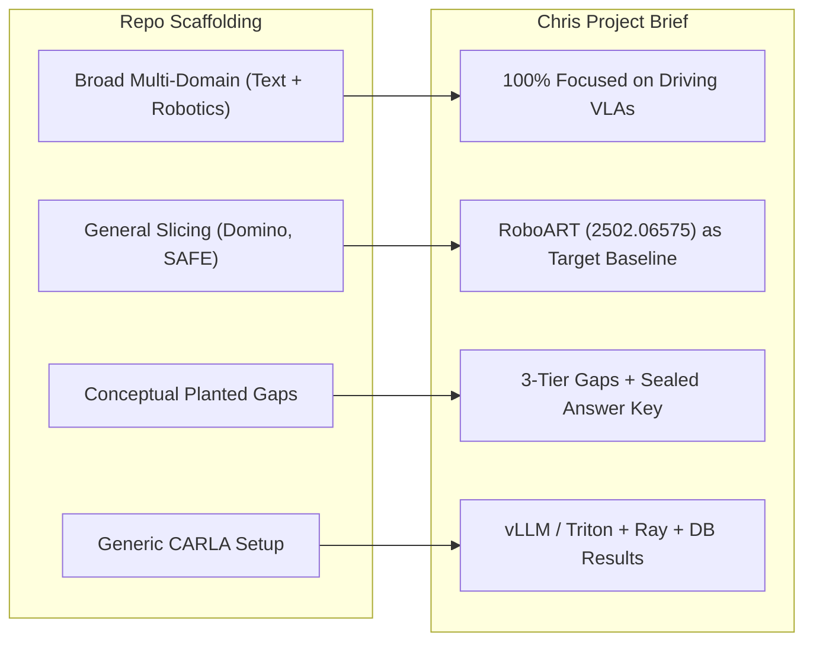
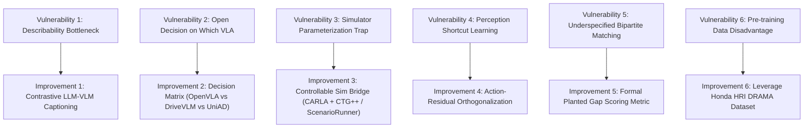

# Diff Report & Strategic Improvements: Failure Axis Discovery in Driving VLAs

> **Document Type**: Technical Review, Diff Analysis, and Architectural Improvements  
> **Source Document**: Chris's Project Brief (*Failure Axis Discovery in Driving VLAs*)  
> **Repository Grounding**: Synthesized against [`docs/PUBLISHABLE_PROPOSALS.md`](PUBLISHABLE_PROPOSALS.md), [`docs/LITERATURE_REVIEW.md`](LITERATURE_REVIEW.md), and [`references.bib`](../references.bib).  
> **Audience**: Jerry Yan, Chris, Catherine Wang, Hiram Lannes, Jason, and autonomous agents.

---

## 1. Executive Diff Report

A side-by-side comparative analysis of **Chris's Project Brief** versus our initial repository scaffolding:



### Detailed Diff Matrix

| Component | Repository Scaffolding ([`docs/`](.)) | Chris's Project Brief | Impact & Strategic Evaluation |
| :--- | :--- | :--- | :--- |
| **Domain Scope** | Dual-track: Text Knowledge Systems (Wildfire, E-waste) vs. Robotics. | **Exclusively Driving VLAs**. Dropped text domains entirely. | **Major Improvement**: Eliminates domain diffusion. Gives the team a single, razor-sharp technical focus for December. |
| **Target Prior Work to Beat** | General slice discovery (Domino, Spotlight) and failure detection (SAFE, ProbeAct). | **RoboART / Predictive Red Teaming ([arXiv:2502.06575](../references.bib#L36-L41))**. | **Vital Precision**: RoboART uses human-enumerated factor lists in manipulation. Beating them with *unsupervised model-derived axes in driving* creates a clear, compelling paper narrative. |
| **Planted Gap Rigor** | Mathematical holdout set $\mathcal{G}^*$ with precision/recall. | **3-Tier Planted Gaps + Sealed Answer Key** (held strictly by Workstream C). | **Major Rigor Boost**: Blind discovery prevents confirmation bias; including an enumerable gap, an interactional gap, and a trivial control gap guarantees diagnostic validity. |
| **Serving & Infrastructure** | Generic PyTorch scripts / CARLA mentioned. | **vLLM / Triton containerized serving + Ray orchestration + SQL Results Database**. | **Critical Engineering Upgrade**: Multiplies rollout throughput so closed-loop retraining can actually run at statistical significance. |
| **Baselines** | Catherine's 3 baselines (Random, Human Taxonomy, Output-only). | Two hard baselines: **(1) Behavioral Stratification**, **(2) Enumerated Factors (RoboART-style)**. | **Streamlined**: Combines human taxonomy and output stratification into the two most lethal academic baselines. |
| **Gating Milestones** | Midterm checkpoint at Week 6. | **Workstream A (Reproduction of published VLA numbers)** strictly gates all downstream work. | **Essential Risk Control**: Prevents wasting time on discovery algorithms over an unverified or broken simulator baseline. |

---

## 2. Strengths of Chris's Brief

1. **Brutal Realism on Prior Work**: Correctly identifies that *failure detection* (SAFE, ProbeAct) and *test-time action guardrails* (RoboMonkey, RoVer) are oversaturated and uninteresting. Centering on **unsupervised data directive discovery** gives the paper a distinct, uncrowded niche.
2. **Fail-Safe Paper Outcomes**: Clearly articulates three paper outcomes:
   - *Best Case*: Axes recovered, beat behavioral baselines, closed in sim $\to$ **Top-tier Oral/Spotlight at NeurIPS/CVPR**.
   - *Middle Case*: Axes recovered, but no better than behavioral baselines $\to$ **Honest comparative study paper on internal vs. external data directives**.
   - *Worst Case*: Axes not recoverable $\to$ **Empirical negative result on the limits of representation probing in sequential policies**.
3. **Engineering Parity & Shared Setup**: The division into Workstreams A–E with a shared infrastructure harness allows everyone to run parallel ablations (layers, pooling, clustering methods) rather than being siloed in one component.

---

## 3. Where We Can Improve the Idea (6 Concrete Upgrades)

While Chris's brief is exceptionally strong, there are **6 critical theoretical and operational vulnerabilities** that need to be addressed before execution:



---

### Improvement 1: Automating the "Describability" Bottleneck (From Eyeball to Multi-Modal Contrastive Attribution)

#### The Vulnerability in the Brief:
Chris writes: *"Hard requirement: the axis must be describable. If nobody can look at the top-activating rollouts and name what they share, it isn't a discovery."*
* **The Risk**: Leaving describability to manual human eyeball inspection introduces severe human cognitive bias, is unscalable across hundreds of SAE features, and academic reviewers (e.g. at NeurIPS/CVPR) will dismiss it as cherry-picked qualitative slop.

#### The Concrete Solution:
Automate the semantic interpretation of discovered axes using **Contrastive Feature Attribution via Vision-Language Models**:
1. For any discovered failure latent feature $f_j$, identify the top-10 failure rollouts $\mathcal{T}_{\text{high}}$ where $f_j$ fired strongly, and the top-10 successful rollouts $\mathcal{T}_{\text{low}}$ where $f_j \approx 0$.
2. Compute gradient-weighted patch activations $\nabla_{z} f_j$ to extract the spatial image patches that activated the feature.
3. Prompt an open multimodal model (via the UC Berkeley Nautilus API, e.g. Llama-3.2-Vision / Qwen2-VL) with a contrastive prompt:
   > *"Given the 10 failure episodes in Group A and 10 success episodes in Group B, what specific environmental condition, agent interaction, or occlusion pattern is uniquely present in Group A that is absent in Group B?"*
4. Run cross-validation: verify that the generated textual description can be used by an independent LLM to predict feature activation on held-out rollouts.

---

### Improvement 2: Resolving the "Which VLA" Decision

#### The Vulnerability in the Brief:
Chris leaves *"Which VLA"* as an open decision for Week 1. However, Workstream A gates everything, and picking the wrong VLA will stall the containerization (vLLM/Triton) and rollout fan-out.

#### The Concrete Solution — VLA Decision Matrix:

| Candidate Architecture | Driving Suitability | Serving (vLLM/Triton) Compatibility | Recommendation |
| :--- | :--- | :--- | :--- |
| **OpenVLA-7B** ([Kim et al., 2024](../references.bib#L65-L71)) | Generalist robotic VLA (7-DoF arm actions). Action tokens must be mapped to driving ($v_x, v_y, \omega_z$). | **Native vLLM support** (built on Llama-2-7B backbone). Highly optimized. | **Recommended for Fast Bring-Up**: Re-tokenize the continuous action head to predict driving speed and steering bins $[0, 255]$. |
| **DriveVLM / DriveVLM-Dual** ([Tian et al., 2024](../references.bib#L85-L91)) | Native autonomous driving VLA with chain-of-thought scene analysis and trajectory prediction. | Moderate (requires custom Triton model backend for dual planner). | **Best for SOTA Driving**: Provides native trajectory outputs and intermediate reasoning tokens. |
| **UniAD / VAD** (CVPR 2023 Best Paper) | Industry standard end-to-end driving benchmark in CARLA/nuScenes. | Difficult to serve in pure vLLM (modular transformer stack). | **Best Control Baseline**, but slower to instrument with standard LLM SAE tools. |

**Final Recommendation**: Use **OpenVLA-7B** fine-tuned on driving control tokens, OR **DriveVLM**. Both run natively on standard Hugging Face / vLLM serving stacks, enabling easy activation extraction at layer 16 via PyTorch forward hooks.

---

### Improvement 3: Solving the Simulator Parameterization Trap (The Scenario Bridge)

#### The Vulnerability in the Brief:
Chris notes: *"Binding constraint is that the scenario generator must be parameterizable along an arbitrary discovered axis. Not all are."*
* **The Risk**: Raw CARLA requires writing hundreds of lines of Python code for each scenario. If discovery outputs an interactional axis like *"yielding pedestrian stepping out behind delivery van under low glare"*, hand-coding matching scenarios breaks the "closed loop" automation claim.

#### The Concrete Solution — The Generative Sim Pipeline:
Do not write raw CARLA scripts. Integrate **ScenarioRunner** paired with **CTG++** ([Zhong et al., CVPR 2023](../references.bib#L118-L124)) or **ChatSim** ([Wang et al., CVPR 2024](../references.bib#L125-L131)):
1. **Parametric Schema**: Define a standard JSON scene schema:
   ```json
   {
     "ego_trajectory": {"initial_speed": 12.5, "maneuver": "unprotected_left"},
     "adversary": {"type": "cyclist", "occluder": "box_truck", "offset_dist": 4.2},
     "environment": {"solar_azimuth": 85, "solar_elevation": 12, "weather": "wet_cloudy"}
   }
   ```
2. **LLM Inversion**: The discovery pipeline uses the Nautilus LLM API to convert the discovered axis description directly into 500 randomized variations of the JSON schema.
3. **Execution**: CARLA `ScenarioRunner` executes the batch in parallel across Ray workers.

---

### Improvement 4: Preventing "Perception Shortcut Learning" in Internal Activations

#### The Vulnerability in the Brief:
Chris acknowledges: *"Holding out 'night rain' might show up as a clean separation for trivial reasons (the pixel statistics differ) rather than because the policy struggles there."*
* **The Risk**: Deep networks encode high-variance perceptual features (sky color, asphalt brightness, rain streaks) much more strongly than subtle decision logic. HDBSCAN or SAEs on raw hidden activations $z_t^{(l)}$ will cluster scenarios by *weather/lighting*, completely missing the *interactional failure*.

#### The Concrete Solution — Action-Residual Orthogonalization:
Before running unsupervised axis discovery, project out the pure visual representation:
1. Extract both the visual prefix tokens $z_t^{\text{vision}}$ and the action prediction tokens $z_t^{\text{action}}$.
2. Train a linear regressor predicting $z_t^{\text{action}}$ from $z_t^{\text{vision}}$. The residual error:
   $$r_t = z_t^{\text{action}} - \mathbf{W}_{\text{proj}} z_t^{\text{vision}}$$
   captures the **pure cognitive policy planning state**, with superficial scene aesthetics subtracted out!
3. Fit the SAE or clustering algorithm exclusively to the residual $r_t$. This guarantees that every discovered cluster corresponds to an *action-decision anomaly* rather than a background pixel change.

---

### Improvement 5: Formal Planted Gap Evaluation Mathematics

#### The Vulnerability in the Brief:
Chris defines precision and recall intuitively, but in practice, matching an unsupervised discovered cluster $\hat{a}_m$ to a planted ground-truth slice $g_k^*$ is non-trivial (unsupervised cluster assignment problem).

#### The Concrete Solution — Bipartite Hungarian Matching:
Let $\mathcal{G}^* = \{g_1^*, g_2^*, \dots, g_K^*\}$ be the set of sealed planted gaps (e.g. $K=3$).  
Let $\hat{\mathcal{A}} = \{\hat{a}_1, \hat{a}_2, \dots, \hat{a}_M\}$ be the discovered clusters/features.

1. For each pair $(g_k^*, \hat{a}_m)$, compute the Mutual Information or Jaccard overlap on rollout indices:
   $$C_{km} = \frac{|\text{Rollouts}(g_k^*) \cap \text{Rollouts}(\hat{a}_m)|}{|\text{Rollouts}(g_k^*) \cup \text{Rollouts}(\hat{a}_m)|}$$
2. Solve the optimal bipartite assignment using the Hungarian algorithm:
   $$\pi^* = \arg\max_\pi \sum_{k=1}^K C_{k, \pi(k)}$$
3. Compute formal metrics:
   $$\text{Planted Recall} = \frac{1}{K} \sum_{k=1}^K \mathbb{I}[C_{k, \pi^*(k)} \ge \theta_{\text{match}}], \quad \text{Discovery Precision} = \frac{\sum_{k=1}^K \mathbb{I}[C_{k, \pi^*(k)} \ge \theta_{\text{match}}]}{M}$$
   where $\theta_{\text{match}} = 0.5$. This provides the exact table reviewers at NeurIPS/CVPR will demand.

---

### Improvement 6: Leveraging Honda Research Institute's DRAMA Dataset for Baseline Training

#### The Strategic Advantage:
Rather than training on generic open-source datasets or collecting random CARLA miles from scratch, anchor the pre-training/fine-tuning phase on **[Honda's DRAMA Dataset](https://usa.honda-ri.com/drama) (WACV 2023)**:
- **17,785 interactive driving clips** collected by Honda Research Institute specifically filtered on **human risk interventions and sudden braking events**.
- Contains synchronized front-camera video, CAN bus signals (steering, brake), and natural language risk explanations.
- **Why this elevates the project**:
  1. Shows direct synergy with your mentor **Ryan Lingo** and **99P Labs / Honda Research Institute**.
  2. Provides an undeniable real-world evaluation bed before running the simulation closed loop.
  3. Pre-training on DRAMA ensures the VLA already understands risk interactions, making the planted failure gap in CARLA significantly more realistic.

---

## 4. Synthesis: Updated Workstream Architecture

Integrating Chris's workstreams with our proposed improvements:

```
┌─────────────────────────────────────────────────────────────────────────────┐
│                       WORKSTREAM A: MODEL & SIM BRING-UP                   │
│  - Select VLA: OpenVLA-7B with continuous driving action tokens or DriveVLM │
│  - Environment: CARLA 0.9.15 + ScenarioRunner                               │
│  - Gate Metric: Reproduce published driving success rates on nominal town   │
└──────────────────────────────────────┬──────────────────────────────────────┘
                                       │ (Gates B, C, D)
         ┌─────────────────────────────┼─────────────────────────────┐
         ▼                             ▼                             ▼
┌──────────────────┐          ┌──────────────────┐          ┌──────────────────┐
│   WORKSTREAM B   │          │   WORKSTREAM C   │          │   WORKSTREAM D   │
│ Serving & Infra  │          │   Planted Gaps   │          │ Discovery & Base │
│ - vLLM / Triton  │          │ - 3 Held-Out     │          │ - Residual Ortho │
│   container      │          │   Slices         │          │ - SAE Latents    │
│ - Ray rollout    │          │ - Sealed Key     │          │ - LLM Captioner  │
│   orchestration  │          │ - Fine-tune      │          │ - 2 Baselines:   │
│ - SQL DB logging │          │   gapped model   │          │   RoboART & Beh. │
└────────┬─────────┘          └────────┬─────────┘          └────────┬─────────┘
         │                             │                             │
         └─────────────────────────────┼─────────────────────────────┘
                                       ▼
┌─────────────────────────────────────────────────────────────────────────────┐
│                        WORKSTREAM E: THE CLOSED LOOP                        │
│  - Invert discovered axis into CTG++ / ScenarioRunner JSON schema           │
│  - Generate 500 counterfactual variations in CARLA                          │
│  - Fine-tune gapped policy via LoRA                                         │
│  - Measure Remediation Rate ΔFail and evaluate on Sealed Answer Key         │
└─────────────────────────────────────────────────────────────────────────────┘
```

This updated plan preserves 100% of Chris's vision while sealing the technical gaps that could otherwise derail the December paper deadline.
