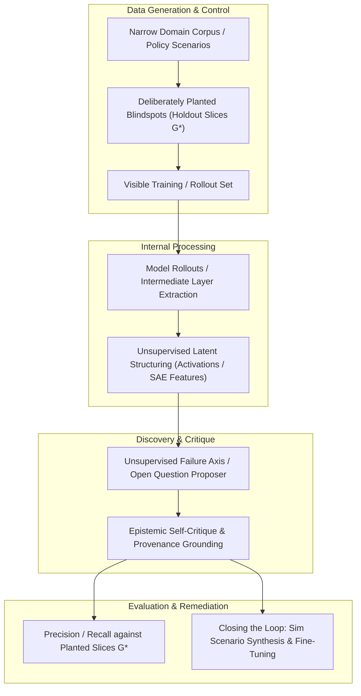

# Research Purpose and Problem Formulation

> **Document Type**: Foundational Research Charter  
> **Affiliation**: 99P Labs / Honda Research Institute, US & UC Berkeley CDSS 170 (Fall 2026)  
> **Project Lead**: Ryan Lingo (Honda Research Institute)  
> **Student Investigators**: Jerry Yan (Zihao Yan), Chris, Catherine Wang, Hiram Lannes, Jason  

---

## 1. Executive Summary & Core Motivation

A standard knowledge system or machine learning policy records what its training distribution already knows. When applied to real-world deployment, critical failures rarely occur on known, well-documented failure modes; instead, they emerge in the **long tail of unknown unknowns**—compound edge cases that human engineers neglected to anticipate or label.

This research project, hosted in collaboration with **99P Labs / Honda Research Institute**, investigates a fundamental question:

> **Core Research Question**:  
> *How might we build a knowledge system that develops layered abstractions, tests and critiques its own internal understanding, and discovers unsupervised failure axes and high-impact open questions without requiring human engineers to pre-specify the failure taxonomy in advance?*

---

## 2. The Problem with Existing Paradigms

### 2.1 The "Checklist" Fallacy in Policy Auditing
In autonomous driving and robotics, when a policy fails, the standard engineering workflow follows an intuitive heuristic:
1. Human engineers hypothesize a discrete list of challenging conditions: $\{\text{heavy rain}, \text{night driving}, \text{highway merges}, \text{pedestrian occlusions}\}$.
2. Test rollouts are stratified across these predefined bins.
3. Teams send collection fleets or simulators to gather more data specifically on the worst-scoring bins.

**The Bottleneck**: This paradigm is fundamentally bounded by human imagination. If a critical failure axis is a compound nuance—such as *low solar angle blinding an infrared sensor during an unprotected left turn against a background of high-frequency tree shadows*—it remains invisible because nobody wrote down a discrete metadata tag for it.

### 2.2 The Query Bottleneck in Industrial Pipelines
State-of-the-art industry systems, such as Mobileye's **Meteor** (data mining engine) and **Genario** (scenario synthesizer) [Mobileye, 2026], automate the process of mining logged driving data for reproducible failures and synthesizing training variations. However, their search operations still primarily occur in **metadata query space**—an engineer or LLM analyst must first formulate a hypothesis in textual or attribute terms before the pipeline can retrieve or generate matching instances.

### 2.3 The Ground-Truth Dilemma in Automated Scientific Discovery
In LLM-based scientific question generation (e.g., automated literature synthesis), language models can generate hundreds of open questions. However, evaluating whether a surfaced question is profound or vacuous is notoriously difficult without an "answer key." Most systems suffer from ungrounded hallucinations or circular self-evaluations.

---

## 3. Our Hypothesis: Discovery from Internal Representations and Layered Abstractions

We propose that **the system's internal latent space already separates the distinct classes of situations it struggles with**, even when human engineers have provided zero labels.

Specifically:
1. **In Robotics & Autonomous Driving (Track B)**: The intermediate activations (or Sparse Autoencoder feature latents) of an embodied agent (e.g., OpenVLA or an end-to-end driving network) exhibit distinct geometric clustering that corresponds to the fundamental axes of policy failure. Reading activation space directly exposes the true failure axes.
2. **In Engineering Literature & Knowledge Bases (Track A)**: By structuring a corpus into atomic, provenance-carrying claims and deriving layered conceptual abstractions, cross-claim contradictions and epistemic "thinness" can be systematically detected to yield rigorous, falsifiable open questions.

---

## 4. Formal Problem Formulations

### 4.1 Track A: Falsifiable Open-Question Discovery over Text Corpora

Let $\mathcal{D} = \{d_1, d_2, \dots, d_N\}$ be a controlled corpus of domain documents. Each document encodes a set of atomic scientific claims $\mathcal{C} = \{c_i\}_{i=1}^M$, where each claim $c_i = (s_i, p_i, o_i, \text{prov}_i)$ contains a semantic subject-predicate-object triple bound to strict textual provenance $\text{prov}_i$.

1. **Abstraction Layer**: An operator $\Phi: \mathcal{P}(\mathcal{C}) \to \mathcal{H}$ aggregates low-level empirical findings into higher-order theoretical principles $\mathcal{H}$.
2. **Epistemic Self-Critique**: An operator $\Psi: \mathcal{H} \to [0, 1]$ estimates evidence density, claim alignment, and cross-source consistency.
3. **Question Formulation**: Surfaces an ordered set of open research questions $\mathcal{Q} = \{q_1, q_2, \dots, q_K\}$ corresponding to regions where $\Psi(h)$ is minimal, but where surrounding foundational claims provide high supporting evidence.

### 4.2 Track B: Policy Failure Axis Discovery via Internal Activations

Let $\pi_\theta$ be an embodied neural policy (e.g., Vision-Language-Action driving policy). Let $\tau = \{(s_t, a_t, r_t)\}_{t=1}^T$ denote an execution rollout trajectory in an environment.

1. **Activation Trajectory**: At each timestep $t$, we record the internal layer activations $z_t^{(l)} \in \mathbb{R}^d$ from layer $l$ of policy $\pi_\theta$.
2. **Episodic Representation**: We construct an episodic embedding $\mathbf{z}_\tau = \text{Pool}(\{z_t^{(l)}\}_{t=1}^T)$.
3. **Unsupervised Axis Discovery**: We learn an unsupervised clustering or sparse decomposition $\Gamma: \mathcal{Z} \to \mathcal{A}$, identifying discrete axes $a \in \mathcal{A}$ associated with high policy degradation without observing scenario metadata.
4. **Planted Gap Verification**: We evaluate $\mathcal{A}$ against known held-out conditions $\mathcal{G}^*$ using precision and recall.

---

## 5. Course Requirements, Milestones, and Deliverables

Per the specification from **Ryan Lingo (Honda Research Institute / 99P Labs)** for CDSS 170:

| Timeline | Milestone | Key Deliverables |
| :--- | :--- | :--- |
| **Weeks 1–3** | Problem Scoping & Domain Selection | Literature review, domain selection, mentoring agreement, formal hypothesis definition. |
| **Weeks 4–6** | Corpus Construction & First Abstraction Layer | Documented corpus (200–300 items) or simulated rollout dataset with explicit collection rules; hand-inspected sample; first end-to-end abstraction/probing layer operational; evaluation metric finalized. |
| **Weeks 7–9** | Self-Critique & Baseline Benchmarking | Full implementation of self-critique / axis discovery; benchmarking against Catherine's 3 required baselines (Random, Human Taxonomy, Behavior-only). |
| **Weeks 10–12** | Full Pipeline, Evaluation & Dissemination | Ranked list of open questions / failure axes with justifications; precision/recall against holdouts; closed-loop simulation experiment; project blog post, poster, and 3-minute video demo. |

---

## 6. High-Impact Publication Targets

To serve as a cornerstone for student research credentials and industry impact, this work targets:
- **NeurIPS 2026 / 2027**: *Workshop on Interpretability for Discovery (Interp4Discovery)* or main track (Track: Interpretability / AI for Science).
- **CVPR / ICCV 2026–2027**: Vision-Language-Action and Autonomous Driving tracks.
- **IEEE ICRA / IROS 2026–2027**: Learning for Mobile Manipulation / Autonomous Systems Failure Analysis.
- **IEEE Transactions on Intelligent Vehicles (T-IV)** or **IEEE T-ITS**: Long-tail safety and edge-case discovery.
- **ACL / EMNLP 2026–2027**: Automated scientific discovery and hypothesis generation.
