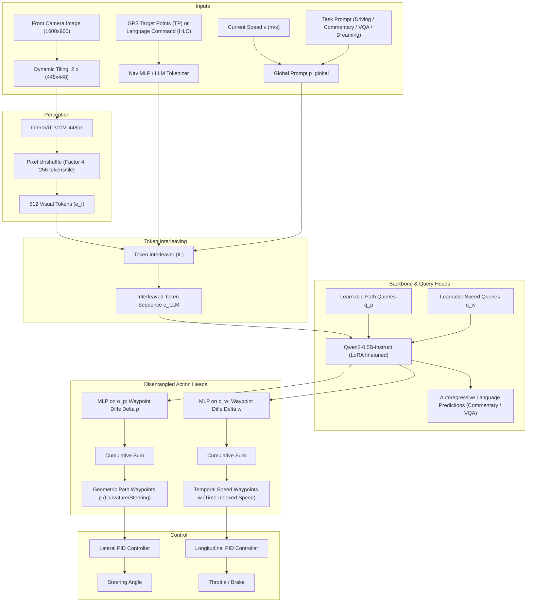
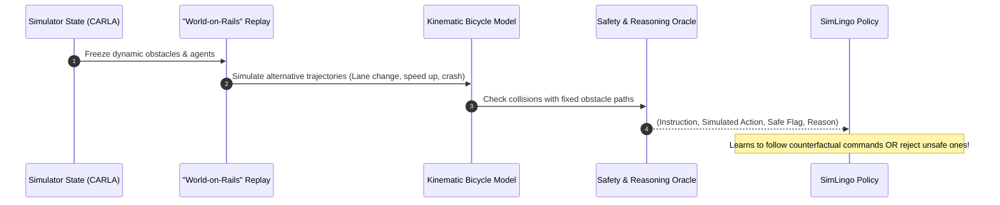
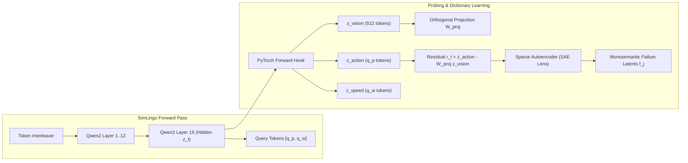

# SimLingo: Vision-Only Closed-Loop Autonomous Driving with Language-Action Alignment

> **Document Type**: Primary Literature Breakdown & Tactical Research Integration  
> **Source Paper**: [arXiv:2503.09594](https://arxiv.org/abs/2503.09594) (Preliminary Report: [arXiv:2406.10165](https://arxiv.org/abs/2406.10165))  
> **Local PDF Copy**: [`papers/simlingo_2503.09594.pdf`](../papers/simlingo_2503.09594.pdf)  
> **Venue**: IEEE/CVF Conference on Computer Vision and Pattern Recognition (CVPR) 2025  
> **Authors**: Katrin Renz (Wayve / Univ. of Tübingen), Long Chen (Wayve), Elahe Arani (Wayve), Oleg Sinavski (Wayve)  
> **Official Code**: [GitHub (`RenzKa/simlingo`)](https://github.com/RenzKa/simlingo)  
> **Model Weights**: [Hugging Face (`RenzKa/simlingo`)](https://huggingface.co/RenzKa/simlingo)  
> **BibTeX Key**: `@simlingo2025` / `@Renz2025cvpr` in [`references.bib`](../references.bib)

---

## 1. Executive Summary & Why This Matters for 99P Labs

In autonomous driving research, integrating Large Language Models (LLMs) and Vision-Language Models (VLMs) has promised enhanced explainability and out-of-distribution generalization. However, prior efforts have been severely bifurcated:
- **Driving-centric models** (e.g., TransFuser, TCP, UniAD) achieve competitive waypoint control but possess zero language reasoning or explainability.
- **VLM/VQA-centric models** (e.g., DriveLM, Lingo-1, DriveVLM) answer static questions about driving scenes but frequently produce language outputs that contradict their actual steering and throttle actions, or they only evaluate on open-loop logs (NuScenes) without closed-loop survival capabilities.

**SimLingo** resolves this dichotomy. It is a lightweight (~800M parameter) **vision-only Vision-Language-Action (VLA)** model that simultaneously handles:
1. **Closed-loop autonomous driving** (winning entry of the CARLA Challenge 2024 and SOTA on Bench2Drive).
2. **Vision-language scene understanding** (Chain-of-Thought driving commentary and DriveLM VQA).
3. **Language-action alignment via "Action Dreaming"** (synthesizing and evaluating counterfactual instruction-following futures without executing unsafe actions).

For our **99P Labs / Honda Research Institute (HRI-US) CDSS 170 project**, SimLingo represents a **critical technical breakthrough**:
- **Solves the "Which VLA" Dilemma**: Rather than hacking a 7B robotics manipulation arm model (OpenVLA-7B) to predict vehicle bins, SimLingo provides a pre-trained, driving-native VLA with open Hugging Face weights and native CARLA Leaderboard 2.0 integration.
- **Ideal Sandbox for Mechanistic Probing (ActAxis)**: Its compact architecture (Qwen2-0.5B + InternViT-300M) allows rapid extraction of hidden layer activations, attention matrices, and action query tokens on modest GPU infrastructure.
- **Native Decoupling for Action-Residual Orthogonalization**: SimLingo already decomposes actions into geometric path tokens and temporal speed tokens, allowing us to mathematically isolate whether a failure axis stems from spatial perception or longitudinal planning.

---

## 2. Model Architecture & Technical Breakdown

### 2.1 Perception & Visual Token Downsampling
- **Dynamic Resolution Tiling**: To detect distant traffic lights and small obstacles at high speed, SimLingo splits the high-resolution front camera image into $N_I = 2$ tiles of $448 \times 448$ pixels.
- **InternViT-300M**: Each tile is encoded independently via `InternViT-300M-448px` (CLIP pre-trained).
- **Pixel Unshuffle ($\rho$)**: To prevent LLM quadratic memory explosion, spatial tokens are compressed by a factor of 4 using pixel unshuffle, reducing each tile to 256 tokens ($N_I \times 256 = 512$ visual tokens total in embedding dimension $D$).

### 2.2 Conditioning & The Global Prompt
The input sequence is unified via a global prompt structure:
$$\mathbf{p}_{\text{global}} = \langle e_I \rangle \parallel \text{"\nCurrent speed: "} \langle v \rangle \text{" m/s. Command: "} \langle e_{\text{nav}} \rangle \text{". "} \langle p_{\text{task}} \rangle$$
Where:
- $e_{\text{nav}} \in \mathbb{R}^{2 \times D}$ when conditioned on GPS Target Points (encoded via 2-layer MLP).
- $e_{\text{nav}} \in \mathbb{R}^{N_{\text{HLC}} \times D}$ when conditioned on natural language commands (e.g., *"turn right at the next intersection"*).
- $p_{\text{task}}$ selects one of four tasks:
  1. **Driving**: `"Predict the waypoints."`
  2. **Commentary + Driving**: `"What should the ego do next?"` (Triggers Chain-of-Thought reasoning).
  3. **VQA + Driving**: `"Q: <question>?"`
  4. **Action Dreaming**: `" <Dreamer flag> <instruction>."`

### 2.3 Disentangled Path vs. Speed Action Representation
Standard driving models predict a single sequence of time-indexed waypoints $w_t = (x_t, y_t)$ at $0.25\text{s}$ intervals. **SimLingo demonstrates that this entangled representation suffers from severe lateral instability**—when the vehicle is stationary at a red light or stopped behind an obstacle, temporal waypoints collapse to $(0, 0)$, leaving the steering controller with zero geometric gradient.

SimLingo introduces **disentangled action queries**:
1. **Geometric Path Waypoints** $p \in \mathbb{R}^{N_p \times 2}$: $N_p$ spatial coordinates spaced exactly **1 meter apart**, invariant to time or vehicle speed. This provides dense curvature supervision even when stopped.
2. **Temporal Speed Waypoints** $w \in \mathbb{R}^{N_w \times 2}$: $N_w$ future coordinates at **$0.25\text{s}$ intervals**, representing time-to-distance progress.
3. **Non-Autoregressive Query Decoding**: Learnable query tokens $q_p$ and $q_w$ are concatenated with the prompt tokens. A lightweight MLP predicts coordinate deltas $\Delta p, \Delta w$, and cumulative summation yields the final waypoints.

---

## 3. The Action Dreaming Paradigm

A fundamental contribution of the SimLingo paper is identifying the **Language-Action Misalignment Problem** in driving:
> When language instruction-action pairs are annotated post-hoc on human or rule-based expert trajectories, the visual cues already uniquely specify what the car should do. The model learns to ignore the text tokens completely, achieving high driving scores while being effectively "deaf" to instructions.

### Mechanics of Action Dreaming:
1. **"World-on-Rails" Kinematic Simulation**:
   Using logged CARLA states from Town 12 and Town 13, all dynamic agents are treated as moving along fixed historical paths ("on rails"). The ego vehicle's future is simulated across counterfactual maneuvers (lane shifts, sidewalk excursions, sudden stops, accelerating toward cones) using a kinematic bicycle model.
2. **Counterfactual Diversity**:
   For the exact same visual frame, multiple alternative instructions are generated:
   - Target speed adjustments (*"drive at 30 km/h"*).
   - Evasive maneuvers (*"swerve onto the left shoulder"*).
   - Adversarial / safety violations (*"drive into the construction cone"*, *"run the red light"*).
3. **Safety Verification & Rejection Head**:
   Each counterfactual trajectory is annotated with an objective safety flag (`safe_to_execute`) and a natural language explanation. When the dreamer flag is off, the model is trained to explicitly decline hazardous instructions.

---

## 4. Empirical Performance Benchmarks

### 4.1 Official CARLA Leaderboard 2.0 (Sensor Track)
The CARLA Leaderboard 2.0 is notorious for crushing previous generation models (TransFuser dropped from 66.3 DS on LB 1.0 to 0.58 DS on LB 2.0).

| Model | Sensor Modalities | Driving Score (DS) $\uparrow$ | Route Completion (RC) $\uparrow$ | Infraction Score (IS) $\uparrow$ | Static Collisions $\downarrow$ |
| :--- | :--- | :---: | :---: | :---: | :---: |
| **CaRINA hybrid** | Camera + LiDAR | 1.48 | 15.3 | 0.42 | High |
| **TransFuser++ (TF++)** | Camera + LiDAR | 5.16 | 28.4 | 0.51 | Moderate |
| **SimLingo-BASE (Ours)** | **Camera-Only (Vision)** | **6.87** | **31.2** | **0.58** | **0.00** |
| *$\Delta$ vs. Entangled Head* | *Ablation (Path+Speed)* | *+39.9% gain* | *+18.1% gain* | *+14.3% gain* | *-100% (Zero)* |

> [!IMPORTANT]
> SimLingo is the **only vision-only model** to achieve competitive performance on CARLA Leaderboard 2.0, outperforming multi-modal LiDAR baselines while eliminating static obstacle collisions entirely.

### 4.2 Bench2Drive (Local Benchmark - 220 Routes)
Bench2Drive evaluates closed-loop autonomy across 220 distinct safety-critical scenarios in CARLA:

| Model | Driving Score (DS) $\uparrow$ | Success Rate (SR %) $\uparrow$ | Commentary GPT-Score $\uparrow$ | DriveLM VQA Score $\uparrow$ |
| :--- | :---: | :---: | :---: | :---: |
| **TCP-traj (baseline)** | 49.30 | 38.18 | N/A | N/A |
| **Think2Drive (privileged)** | 67.45 | 54.09 | N/A | N/A |
| **SimLingo-BASE** | 85.12 | 67.73 | N/A | N/A |
| **SimLingo (Full VLA)** | **85.07** | **67.27** | **78.94** | **58.48** |

*Key Takeaway*: Fine-tuning the LLM on multi-task language (VQA + Commentary + Dreaming) preserves 99.9% of pure driving performance while acquiring advanced visual reasoning.

---

## 5. Tactical Integration Guide for 99P Labs / Honda Research

### 5.1 Resolving Workstream A: Why SimLingo Beats OpenVLA-7B
In our initial discussions (see [`docs/feedback.md`](feedback.md) and [`docs/PROJECT_BRIEF_DIFF_AND_IMPROVEMENTS.md`](PROJECT_BRIEF_DIFF_AND_IMPROVEMENTS.md)), the team deliberated on selecting a baseline VLA. SimLingo is decisively superior:

| Evaluation Dimension | OpenVLA-7B | DriveVLM | **SimLingo (CVPR 2025)** |
| :--- | :--- | :--- | :--- |
| **Parameter Scale** | 7.0 Billion (Llama-2) | ~8–13 Billion | **0.8 Billion (~800M)** |
| **Domain Grounding** | Robotic Arms (Bridge/RT-X) | Driving Scene Understanding | **End-to-End Driving (CARLA LB 2.0)** |
| **Action Output** | 7-DoF joint angles (hacked to bins) | Trajectory waypoints (Triton) | **Disentangled Path + Speed Waypoints** |
| **Closed-Loop CARLA** | Requires custom wrapper & controller | Untested closed-loop in LB 2.0 | **Winner of CARLA Challenge 2024** |
| **Activation Extraction** | Heavy ($>16$ GB VRAM per rollout) | Heavy ($>24$ GB VRAM) | **Lightweight ($<4$ GB VRAM per rollout)** |
| **Weights Availability** | Hugging Face (`openvla-7b`) | Weights not publicly unified | **Hugging Face (`RenzKa/simlingo`)** |

**Tactical Decision**: Adopt **SimLingo as the primary VLA policy for Track B and Workstream A**.

---

### 5.2 Mechanistic Probing & SAE Latent Extraction (Proposal 1: ActAxis)
To apply our Sparse Autoencoder (SAE) dictionary learning pipeline to SimLingo:

1. **Extraction Site**:
   Attach PyTorch forward hooks to `model.language_model.model.layers[16]` and the action query heads `model.path_queries` and `model.speed_queries`.
2. **Action-Residual Orthogonalization**:
   Because SimLingo interleaves visual tokens and query tokens in the same self-attention sequence, superficial visual features (lighting, asphalt color, rain streaks) bleed into the action tokens. We compute the action residual:
   $$r_t^{\text{path}} = z_t^{q_p} - \mathbf{W}_{\text{proj}}^{\text{path}} \left(\frac{1}{512} \sum_{i=1}^{512} z_t^{\text{vision}, i}\right)$$
3. **Training the SAE**:
   Train an overcomplete TopK / JumpReLU SAE ($M = 8 \times D = 16{,}384$ latents) exclusively on the residual $r_t^{\text{path}}$. Discovered latents represent **pure lateral planning decisions**, completely isolated from scene illumination.

---

### 5.3 Planted Gap Evaluation & Catherine's Baselines
SimLingo provides an out-of-the-box mechanism for Catherine's planted gap protocol:
1. **Withhold an Action Dreaming Category**:
   In SimLingo's dataset generator, hold out all scenarios tagged with `category == "sidewalk_pedestrian_near_miss"` from training.
2. **Collect Evaluation Rollouts**:
   Run rollouts of the un-retrained policy across Bench2Drive routes containing this scenario.
3. **Evaluate Discovery**:
   Compute Hungarian bipartite matching between our unsupervised SAE clusters and the sealed planted holdout $\mathcal{G}^*$:
   $$\text{Precision} = \frac{|\mathcal{A}_{\text{discovered}} \cap \mathcal{G}^*|}{|\mathcal{A}_{\text{discovered}}|}, \quad \text{Recall} = \frac{|\mathcal{A}_{\text{discovered}} \cap \mathcal{G}^*|}{|\mathcal{G}^*|}$$
4. **Compare against Catherine's 3 Baselines**:
   - Random Rollout Sampling.
   - Heuristic CARLA Weather $\times$ Town split.
   - Behavioral Output Clustering (clustering purely on $\Delta p, \Delta w$ errors without activations).

---

### 5.4 Closed-Loop Remediation Loop (Proposal 2: SimLoop)
Once an SAE feature $f_j$ isolates a recurring failure mode:
1. **Automated Contrastive Captioning**:
   Feed the top-10 activating frames of $f_j$ to an LLM judge (via Berkeley Nautilus endpoint) with SimLingo's commentary tokens to generate a semantic failure descriptor (e.g., *"unprotected left turn with oncoming delivery van occluding pedestrian"*).
2. **CARLA ScenarioRunner Parameterization**:
   Map the descriptor into a parametric JSON configuration for CARLA's `ScenarioRunner`.
3. **Remediation Fine-Tuning**:
   Generate 500 targeted rollouts and fine-tune SimLingo's LoRA adapters ($r=16$) on Qwen2-0.5B. Measure $\Delta \text{Fail}$ on Bench2Drive.

---

## 6. Repository File & Script References

- **Paper PDF**: [`papers/simlingo_2503.09594.pdf`](../papers/simlingo_2503.09594.pdf)
- **Literature Review Integration**: [`docs/LITERATURE_REVIEW.md`](LITERATURE_REVIEW.md)
- **BibTeX Citations**: [`references.bib`](../references.bib)
- **Team Strategic Diff**: [`docs/PROJECT_BRIEF_DIFF_AND_IMPROVEMENTS.md`](PROJECT_BRIEF_DIFF_AND_IMPROVEMENTS.md)
- **Peer Feedback to Chris**: [`docs/feedback.md`](feedback.md)
- **Published Proposals**: [`docs/PUBLISHABLE_PROPOSALS.md`](PUBLISHABLE_PROPOSALS.md)
