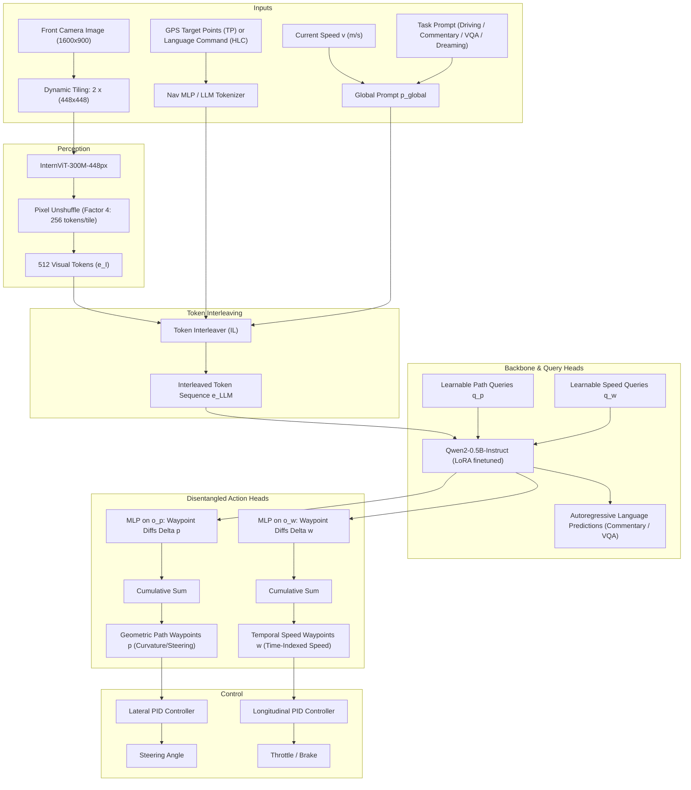
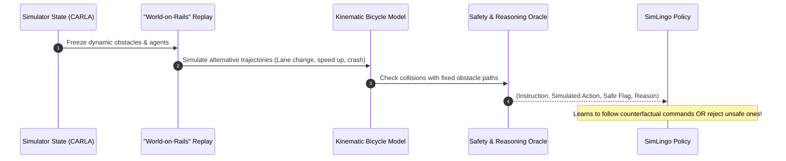
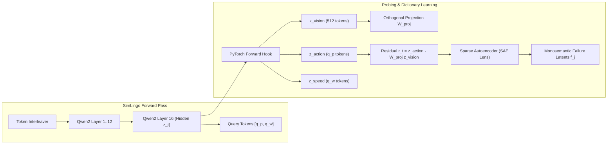

# SimLingo: Vision-Only Closed-Loop Autonomous Driving with Language-Action Alignment

> **Document Type**: Primary Literature Breakdown & Tactical Research Integration  
> **Source Paper**: [arXiv:2503.09594](https://arxiv.org/abs/2503.09594) (Preliminary Report: [arXiv:2406.10165](https://arxiv.org/abs/2406.10165))  
> **Local PDF Copy**: [`papers/simlingo_2503.09594.pdf`](../papers/simlingo_2503.09594.pdf)  
> **Venue**: IEEE/CVF Conference on Computer Vision and Pattern Recognition (CVPR) 2025  
> **Authors**: Katrin Renz (Wayve / Univ. of Tübingen), Long Chen (Wayve), Elahe Arani (Wayve), Oleg Sinavski (Wayve)  
> **Official Code**: [GitHub (`RenzKa/simlingo`)](https://github.com/RenzKa/simlingo)  
> **Model Weights**: [Hugging Face (`RenzKa/simlingo`)](https://huggingface.co/RenzKa/simlingo)  
> **BibTeX Key**: `@simlingo2025` / `@Renz2025cvpr` in [`references.bib`](../references.bib)

> [!WARNING]
> **Errata (2026-09-28).** Several numbers in the original version of this file did not match the paper. §1, §4, §5.1 and §5.4 now hold values checked against the PDF and the repository ([`CITATION_AUDIT.md`](CITATION_AUDIT.md)). Specifically:
> - LB2.0 table: RC/IS columns corrected, plus DS for TF++ (5.16 → 5.18) and CaRINA hybrid (1.48 → 1.23). The unsourced "+18.1% RC / +14.3% IS" ablation gains and the "Static Collisions" column are removed; the paper gives only +39.9% DS and zero static collisions;
> - Bench2Drive TCP-traj SR is 20.45, not 38.18;
> - the "Think2Drive 67.45/54.09" row is removed (it appears in no source);
> - SimLingo-BASE on Bench2Drive is 85.94/66.82, not 85.12/67.73;
> - the unsourced "< 4 GB VRAM" claim is replaced;
> - model size ~800M → ~1B (InternVL2-1B); the DriveVLM column is corrected (9.6B, no public code or weights); §5.4 LoRA r = 16 → the released r = 32 / α = 64;
> - §5.2–§5.4 predate the plan of record and are superseded by `MASTER_HANDOFF.md` §4.2–§4.4. The SAE width is 8×–32× of d = 896 (7,168–28,672 latents), not 16,384. There is no `sidewalk_pedestrian_near_miss` category: the Action Dreaming categories are Faster, Slower, Target Speed, Lane Change and Objects, and withholding dreaming data does not plant a driving gap. Commentary/CoT is never given to the describability model. Targeted data is a PDM-Lite frame sweep (20k primary; 5k / 50k), not "500 targeted rollouts".
>
> The plan of record is now [`MASTER_HANDOFF.md`](MASTER_HANDOFF.md). SimLingo remains the primary policy there.

---

## 1. Executive Summary & Why This Matters for 99P Labs

In autonomous driving research, integrating Large Language Models (LLMs) and Vision-Language Models (VLMs) has promised enhanced explainability and out-of-distribution generalization. However, prior efforts have been severely bifurcated:
- **Driving-centric models** (e.g., TransFuser, TCP, UniAD) achieve competitive waypoint control but possess zero language reasoning or explainability.
- **VLM/VQA-centric models** (e.g., DriveLM, Lingo-1, DriveVLM) answer static questions about driving scenes but frequently produce language outputs that contradict their actual steering and throttle actions, or they only evaluate on open-loop logs (NuScenes) without closed-loop survival capabilities.

**SimLingo** resolves this dichotomy. It is a lightweight (~1B-parameter, InternVL2-1B) **vision-only Vision-Language-Action (VLA)** model that simultaneously handles:
1. **Closed-loop autonomous driving** (state of the art on Bench2Drive at publication, 85.07 DS; its driving-only base model SimLingo-BASE/CarLLaVA won the CARLA Challenge 2024. Newer methods now score higher, e.g. LEAD/TFv6 95.28 vs SimLingo 85.07 DS on the community Bench2Drive v0.0.3 leaderboard (CITATION_AUDIT `lead-tfv6`, `bench2drive`); under v0.0.4 SimLingo is 86.55 DS).
2. **Vision-language scene understanding** (Chain-of-Thought driving commentary and DriveLM VQA).
3. **Language-action alignment via "Action Dreaming"** (synthesizing and evaluating counterfactual instruction-following futures without executing unsafe actions).

For our **99P Labs / Honda Research Institute (HRI-US) CDSS 170 project**, SimLingo represents a **critical technical breakthrough**:
- **Solves the "Which VLA" Dilemma**: Rather than hacking a 7B robotics manipulation arm model (OpenVLA-7B) to predict vehicle bins, SimLingo provides a pre-trained, driving-native VLA with open Hugging Face weights and native CARLA Leaderboard 2.0 integration.
- **Ideal Sandbox for Mechanistic Probing (ActAxis)**: Its compact architecture (Qwen2-0.5B + InternViT-300M) allows rapid extraction of hidden layer activations, attention matrices, and action query tokens on modest GPU infrastructure.
- **Native Decoupling for Action-Residual Orthogonalization**: SimLingo already decomposes actions into geometric path tokens and temporal speed tokens, allowing us to mathematically isolate whether a failure axis stems from spatial perception or longitudinal planning.

---

## 2. Model Architecture & Technical Breakdown

```mermaid
graph TD
    subgraph Inputs
        RGB["Front Camera Image (1600x900)"] --> Tiler["Dynamic Tiling: 2 x (448x448)"]
        Nav["GPS Target Points (TP) or Language Command (HLC)"] --> NavEnc["Nav MLP / LLM Tokenizer"]
        Speed["Current Speed v (m/s)"] --> Prompt["Global Prompt p_global"]
        TaskPrompt["Task Prompt (Driving / Commentary / VQA / Dreaming)"] --> Prompt
    end

    subgraph Perception
        Tiler --> ViT["InternViT-300M-448px"]
        ViT --> PixelUnshuffle["Pixel Unshuffle (Factor 4: 256 tokens/tile)"]
        PixelUnshuffle --> VisualTokens["512 Visual Tokens (e_I)"]
    end

    subgraph Token Interleaving
        VisualTokens --> Interleaver["Token Interleaver (IL)"]
        NavEnc --> Interleaver
        Prompt --> Interleaver
        Interleaver --> InterleavedSeq["Interleaved Token Sequence e_LLM"]
    end

    subgraph Backbone & Query Heads
        InterleavedSeq --> LLM["Qwen2-0.5B-Instruct (LoRA finetuned)"]
        LLM --> LangOut["Autoregressive Language Predictions (Commentary / VQA)"]
        PathQuery["Learnable Path Queries q_p"] --> LLM
        SpeedQuery["Learnable Speed Queries q_w"] --> LLM
    end

    subgraph Disentangled Action Heads
        LLM --> PathDiff["MLP on o_p: Waypoint Diffs Delta p"]
        LLM --> SpeedDiff["MLP on o_w: Waypoint Diffs Delta w"]
        PathDiff --> CumSumP["Cumulative Sum"] --> PathWP["Geometric Path Waypoints p (Curvature/Steering)"]
        SpeedDiff --> CumSumW["Cumulative Sum"] --> SpeedWP["Temporal Speed Waypoints w (Time-Indexed Speed)"]
    end

    subgraph Control
        PathWP --> LatPID["Lateral PID Controller"] --> Steering["Steering Angle"]
        SpeedWP --> LongPID["Longitudinal PID Controller"] --> ThrottleBrake["Throttle / Brake"]
    end
```

### 2.1 Perception & Visual Token Downsampling
- **Dynamic Resolution Tiling**: To detect distant traffic lights and small obstacles at high speed, SimLingo splits the high-resolution front camera image into $N_I = 2$ tiles of $448 \times 448$ pixels.
- **InternViT-300M**: Each tile is encoded independently via `InternViT-300M-448px` (CLIP pre-trained).
- **Pixel Unshuffle ($\rho$)**: To prevent LLM quadratic memory explosion, spatial tokens are compressed by a factor of 4 using pixel unshuffle, reducing each tile to 256 tokens ($N_I \times 256 = 512$ visual tokens total in embedding dimension $D$).

### 2.2 Conditioning & The Global Prompt
The input sequence is unified via a global prompt structure:
$$\mathbf{p}_{\text{global}} = \langle e_I \rangle \parallel \text{"\nCurrent speed: "} \langle v \rangle \text{" m/s. Command: "} \langle e_{\text{nav}} \rangle \text{". "} \langle p_{\text{task}} \rangle$$
Where:
- $e_{\text{nav}} \in \mathbb{R}^{2 \times D}$ when conditioned on GPS Target Points (encoded via 2-layer MLP).
- $e_{\text{nav}} \in \mathbb{R}^{N_{\text{HLC}} \times D}$ when conditioned on natural language commands (e.g., *"turn right at the next intersection"*).
- $p_{\text{task}}$ selects one of four tasks:
  1. **Driving**: `"Predict the waypoints."`
  2. **Commentary + Driving**: `"What should the ego do next?"` (Triggers Chain-of-Thought reasoning).
  3. **VQA + Driving**: `"Q: <question>?"`
  4. **Action Dreaming**: `" <Dreamer flag> <instruction>."`

### 2.3 Disentangled Path vs. Speed Action Representation
Standard driving models predict a single sequence of time-indexed waypoints $w_t = (x_t, y_t)$ at $0.25\text{s}$ intervals. **SimLingo demonstrates that this entangled representation suffers from severe lateral instability**—when the vehicle is stationary at a red light or stopped behind an obstacle, temporal waypoints collapse to $(0, 0)$, leaving the steering controller with zero geometric gradient.

SimLingo introduces **disentangled action queries**:
1. **Geometric Path Waypoints** $p \in \mathbb{R}^{N_p \times 2}$: $N_p$ spatial coordinates spaced exactly **1 meter apart**, invariant to time or vehicle speed. This provides dense curvature supervision even when stopped.
2. **Temporal Speed Waypoints** $w \in \mathbb{R}^{N_w \times 2}$: $N_w$ future coordinates at **$0.25\text{s}$ intervals**, representing time-to-distance progress.
3. **Non-Autoregressive Query Decoding**: Learnable query tokens $q_p$ and $q_w$ are concatenated with the prompt tokens. A lightweight MLP predicts coordinate deltas $\Delta p, \Delta w$, and cumulative summation yields the final waypoints.

---

## 3. The Action Dreaming Paradigm

A fundamental contribution of the SimLingo paper is identifying the **Language-Action Misalignment Problem** in driving:
> When language instruction-action pairs are annotated post-hoc on human or rule-based expert trajectories, the visual cues already uniquely specify what the car should do. The model learns to ignore the text tokens completely, achieving high driving scores while being effectively "deaf" to instructions.

```mermaid
sequenceDiagram
    autonumber
    participant State as Simulator State (CARLA)
    participant Rails as "World-on-Rails" Replay
    participant Bicycle as Kinematic Bicycle Model
    participant Labeler as Safety & Reasoning Oracle
    participant SimLingo as SimLingo Policy

    State->>Rails: Freeze dynamic obstacles & agents
    Rails->>Bicycle: Simulate alternative trajectories (Lane change, speed up, crash)
    Bicycle->>Labeler: Check collisions with fixed obstacle paths
    Labeler-->>SimLingo: (Instruction, Simulated Action, Safe Flag, Reason)
    Note over SimLingo: Learns to follow counterfactual commands OR reject unsafe ones!
```

### Mechanics of Action Dreaming:
1. **"World-on-Rails" Kinematic Simulation**:
   Using logged CARLA states from Town 12 and Town 13, all dynamic agents are treated as moving along fixed historical paths ("on rails"). The ego vehicle's future is simulated across counterfactual maneuvers (lane shifts, sidewalk excursions, sudden stops, accelerating toward cones) using a kinematic bicycle model.
2. **Counterfactual Diversity**:
   For the exact same visual frame, multiple alternative instructions are generated:
   - Target speed adjustments (*"drive at 30 km/h"*).
   - Evasive maneuvers (*"swerve onto the left shoulder"*).
   - Adversarial / safety violations (*"drive into the construction cone"*, *"run the red light"*).
3. **Safety Verification & Rejection Head**:
   Each counterfactual trajectory is annotated with an objective safety flag (`safe_to_execute`) and a natural language explanation. When the dreamer flag is off, the model is trained to explicitly decline hazardous instructions.

---

## 4. Empirical Performance Benchmarks

### 4.1 Official CARLA Leaderboard 2.0 (Sensor Track)
The CARLA Leaderboard 2.0 is notorious for crushing previous generation models (TransFuser dropped from 66.3 DS on LB 1.0 to 0.58 DS on LB 2.0).

Paper Table 1, official LB2.0 test server, **SENSORS** track (the MAP track is in the paper):

| Model | Sensors | Driving Score (DS) $\uparrow$ | Route Completion (RC) $\uparrow$ | Infraction Score (IS) $\uparrow$ |
| :--- | :--- | :---: | :---: | :---: |
| Zero-shot TF++ (LB 1.0 model) | LiDAR + Camera | 0.58 | 8.53 | 0.38 |
| **CaRINA hybrid** | LiDAR + Camera | 1.23 | 9.56 | 0.31 |
| **TransFuser++ (TF++)** | LiDAR + Camera | 5.18 | 11.34 | 0.48 |
| **SimLingo-BASE** (= CarLLaVA; LLaVA CLIP-ViT encoder + 50M-parameter LLaMA-style decoder trained from scratch; no language) | **Camera only** | **6.87** | **18.08** | **0.42** |

*Output-representation ablation (paper):* disentangled path + speed waypoints raise DS by **39.9%** over entangled waypoints and cut layout (static) collisions from 0.68 to 0.

> [!IMPORTANT]
> Per the paper, SimLingo-BASE is the only camera-only entry on the LB2.0 leaderboard among entries with a method report. It won the 2024 CARLA Challenge. The full SimLingo VLA was **not** submitted to LB2.0: the leaderboard closed in June 2024.

### 4.2 Bench2Drive (Local Benchmark - 220 Routes)
Bench2Drive evaluates closed-loop driving on 220 short routes (≈ 150 m each) in CARLA 0.9.15: 44 interactive scenario types × 5 routes each.

Paper Table 2 (Bench2Drive v0.0.3 protocol, 220 routes). The Bench2Drive v0.0.4 README (Aug 2026) lists SimLingo at 86.55 / 70.45, so always state the version.

| Model | Expert (training data) | DS $\uparrow$ | SR (%) $\uparrow$ |
| :--- | :--- | :---: | :---: |
| TCP-traj* (with expert-feature distillation) | Think2Drive | 59.90 | 30.00 |
| TCP-traj w/o distillation | Think2Drive | 49.30 | 20.45 |
| TCP-traj w/o distillation, SimLingo data + tuned controller | PDM-Lite | 63.45 | 37.79 |
| **SimLingo-BASE** (LB2.0 model) | PDM-Lite | 85.94 | 66.82 |
| **SimLingo** (full VLA, 3 seeds) | PDM-Lite | **85.07 ± 0.95** | **67.27 ± 2.11** |
| SimLingo **without** CoT at inference (Table 10) | PDM-Lite | 84.41 ± 1.76 | 64.84 ± 2.42 |

**Language scores** (Table 3, SimLingo-1B): DriveLM-VQA GPT-score **58.48** and Commentary GPT-score **78.94**.

**Multi-ability SR** (Table 8):

| Merging | Overtaking | Emergency Brake | Give Way | Traffic Sign |
| :---: | :---: | :---: | :---: | :---: |
| 54.01 | 57.04 | 88.33 | 53.33 | 82.45 |

*Key takeaway:* adding language tasks (VQA, commentary, dreaming) leaves driving performance within seed variance of the driving-only SimLingo-BASE (85.07 vs 85.94 DS; SR 67.27 vs 66.82). Think2Drive is a *privileged* RL expert (91.85 DS / 85.41 SR on the Bench2Drive leaderboard), not a comparable sensor policy.

---

## 5. Tactical Integration Guide for 99P Labs / Honda Research

### 5.1 Resolving Workstream A: Why SimLingo Beats OpenVLA-7B
In our initial discussions (see [`docs/feedback.md`](feedback.md) and [`docs/PROJECT_BRIEF_DIFF_AND_IMPROVEMENTS.md`](PROJECT_BRIEF_DIFF_AND_IMPROVEMENTS.md)), the team deliberated on selecting a baseline VLA. SimLingo is decisively superior:

| Evaluation Dimension | OpenVLA-7B | DriveVLM | **SimLingo (CVPR 2025)** |
| :--- | :--- | :--- | :--- |
| **Parameter Scale** | 7B (Llama-2 / Prismatic) | 9.6B (Qwen-VL) | **~1B (InternVL2-1B: InternViT-300M + Qwen2-0.5B)** |
| **Domain Grounding** | Robot manipulation (Open X-Embodiment) | Driving scene understanding | **End-to-End Driving (CARLA LB 2.0 / Bench2Drive)** |
| **Action Output** | 7-D end-effector actions as discretized tokens | Trajectory waypoints | **Disentangled Path + Speed Waypoints** |
| **Closed-Loop CARLA** | None (would need a custom driving port) | None (nuScenes + in-house SUP-AD only) | **SimLingo-BASE won the CARLA Challenge 2024** |
| **Rollout GPU memory** | 7B-class | n/a (no public weights) | **≈ 11.4 GB whole-GPU usage with the CARLA server and the agent on one 16 GB RTX 4060 Ti (user report, GitHub issue #95; model-only memory not yet measured); ≈ 0.045–0.065× real time there, ≈ 0.08× on an A6000 with inference_skip = 5 (third-party fork)** |
| **Weights Availability** | Hugging Face (`openvla/openvla-7b`) | **No public code or weights** | **Hugging Face (`RenzKa/simlingo`) + training dataset (Wayve non-commercial licence)** |

**Tactical Decision**: Adopt **SimLingo as the primary VLA policy for Track B and Workstream A**.

---

### 5.2 Mechanistic Probing & SAE Latent Extraction (Proposal 1: ActAxis)
To apply our Sparse Autoencoder (SAE) dictionary learning pipeline to SimLingo:

```mermaid
graph LR
    subgraph SimLingo Forward Pass
        Tokens["Token Interleaver"] --> QwenL1["Qwen2 Layer 1..12"]
        QwenL1 --> QwenL16["Qwen2 Layer 16 (Hidden z_t)"]
        QwenL16 --> Heads["Query Tokens [q_p, q_w]"]
    end

    subgraph Probing & Dictionary Learning
        QwenL16 --> Hook["PyTorch Forward Hook"]
        Hook --> VisTokens["z_vision (512 tokens)"]
        Hook --> PathTokens["z_action (q_p tokens)"]
        Hook --> SpeedTokens["z_speed (q_w tokens)"]

        VisTokens --> Ortho["Orthogonal Projection W_proj"]
        PathTokens --> Residual["Residual r_t = z_action - W_proj z_vision"]
        Residual --> SAE["Sparse Autoencoder (SAE Lens)"]
        SAE --> FeatureLatents["Monosemantic Failure Latents f_j"]
    end
```

1. **Extraction Site**:
   Attach PyTorch forward hooks to `model.language_model.model.layers[16]` and the action query heads `model.path_queries` and `model.speed_queries`.
2. **Action-Residual Orthogonalization**:
   Because SimLingo interleaves visual tokens and query tokens in the same self-attention sequence, superficial visual features (lighting, asphalt color, rain streaks) bleed into the action tokens. We compute the action residual:
   $$r_t^{\text{path}} = z_t^{q_p} - \mathbf{W}_{\text{proj}}^{\text{path}} \left(\frac{1}{512} \sum_{i=1}^{512} z_t^{\text{vision}, i}\right)$$
3. **Training the SAE**:
   Train an overcomplete TopK / JumpReLU SAE ($M = 8 \times D = 16{,}384$ latents) exclusively on the residual $r_t^{\text{path}}$. Discovered latents represent **pure lateral planning decisions**, completely isolated from scene illumination.

---

### 5.3 Planted Gap Evaluation & Catherine's Baselines
SimLingo provides an out-of-the-box mechanism for Catherine's planted gap protocol:
1. **Withhold an Action Dreaming Category**:
   In SimLingo's dataset generator, hold out all scenarios tagged with `category == "sidewalk_pedestrian_near_miss"` from training.
2. **Collect Evaluation Rollouts**:
   Run rollouts of the un-retrained policy across Bench2Drive routes containing this scenario.
3. **Evaluate Discovery**:
   Compute Hungarian bipartite matching between our unsupervised SAE clusters and the sealed planted holdout $\mathcal{G}^*$:
   $$\text{Precision} = \frac{|\mathcal{A}_{\text{discovered}} \cap \mathcal{G}^*|}{|\mathcal{A}_{\text{discovered}}|}, \quad \text{Recall} = \frac{|\mathcal{A}_{\text{discovered}} \cap \mathcal{G}^*|}{|\mathcal{G}^*|}$$
4. **Compare against Catherine's 3 Baselines**:
   - Random Rollout Sampling.
   - Heuristic CARLA Weather $\times$ Town split.
   - Behavioral Output Clustering (clustering purely on $\Delta p, \Delta w$ errors without activations).

---

### 5.4 Closed-Loop Remediation Loop (Proposal 2: SimLoop)
Once an SAE feature $f_j$ isolates a recurring failure mode:
1. **Automated Contrastive Captioning**:
   Feed the top-10 activating frames of $f_j$ to an LLM judge (via Berkeley Nautilus endpoint) with SimLingo's commentary tokens to generate a semantic failure descriptor (e.g., *"unprotected left turn with oncoming delivery van occluding pedestrian"*).
2. **CARLA ScenarioRunner Parameterization**:
   Map the descriptor into a parametric JSON configuration for CARLA's `ScenarioRunner`.
3. **Remediation Fine-Tuning**:
   Generate 500 targeted rollouts and fine-tune SimLingo's LoRA adapters on Qwen2-0.5B (the released configs use $r=32$, $\alpha=64$). Measure $\Delta \text{Fail}$ on Bench2Drive.

---

## 6. Repository File & Script References

- **Paper PDF**: [`papers/simlingo_2503.09594.pdf`](../papers/simlingo_2503.09594.pdf)
- **Literature Review Integration**: [`docs/LITERATURE_REVIEW.md`](LITERATURE_REVIEW.md)
- **BibTeX Citations**: [`references.bib`](../references.bib)
- **Team Strategic Diff**: [`docs/PROJECT_BRIEF_DIFF_AND_IMPROVEMENTS.md`](PROJECT_BRIEF_DIFF_AND_IMPROVEMENTS.md)
- **Peer Feedback to Chris**: [`docs/feedback.md`](feedback.md)
- **Published Proposals**: [`docs/PUBLISHABLE_PROPOSALS.md`](PUBLISHABLE_PROPOSALS.md)
